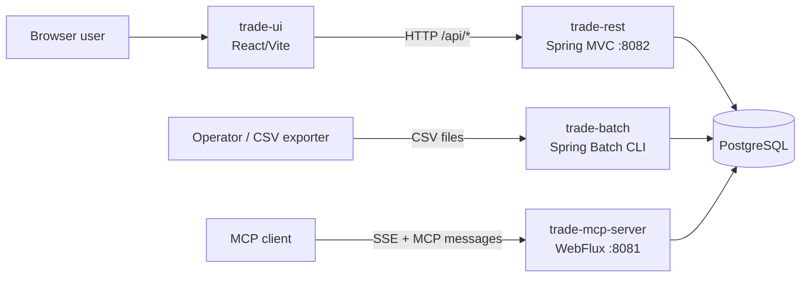
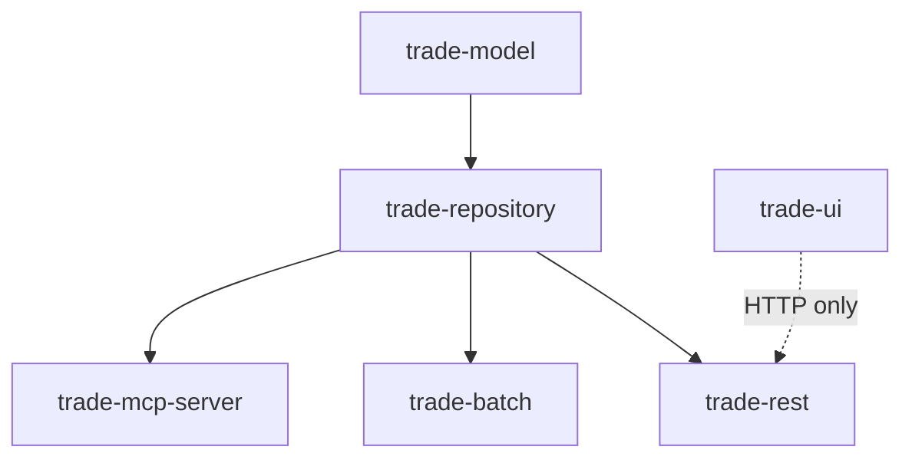
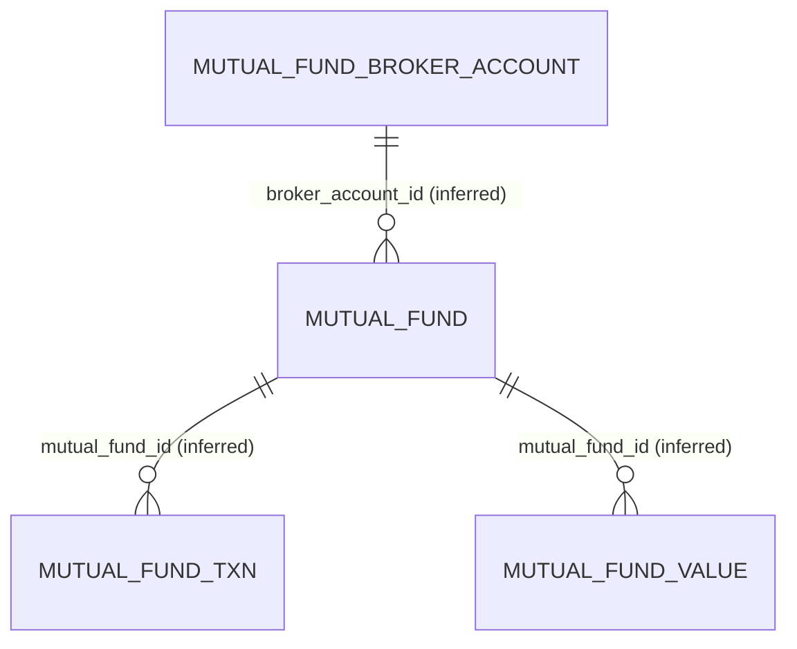
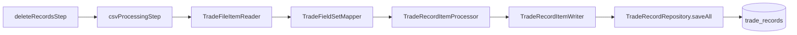
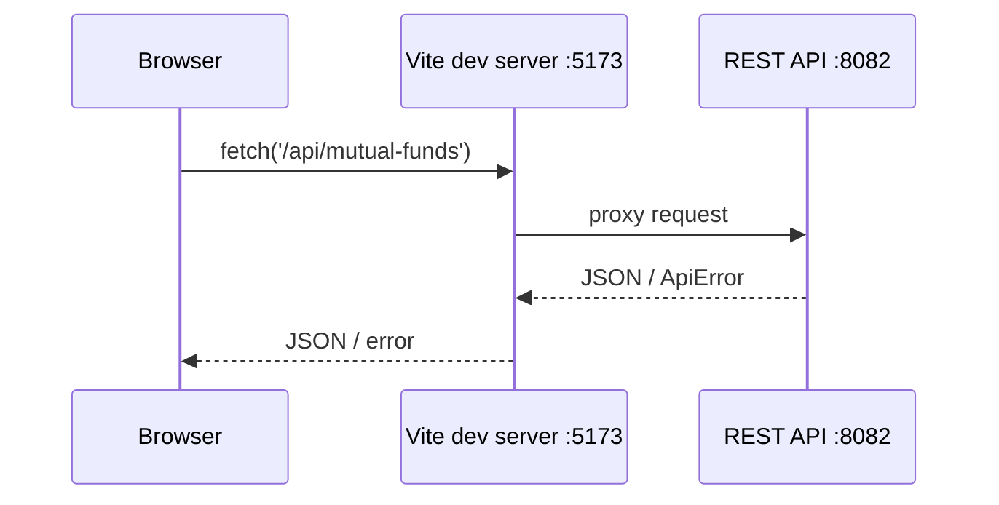

# Technical Architecture Reference

This document is the verified engineering reference for this repository. It complements `README.md`: the README is an introduction and risk summary, while this document records code-level evidence, call paths, uncertainty, and validation results. It was produced without modifying production code.

## 1. System Context

The system manages two adjacent sets of financial data in a shared PostgreSQL database:

1. Mutual-fund master data, transactions, and valuations, exposed as a browser-oriented REST API.
2. Equity trade and ledger records, ingested from CSV files and queried by an MCP server for analytical responses.

External actors are a browser user, CSV-producing/export systems or an operator, an MCP client, and PostgreSQL.



**Verified scope:** no message broker, cache, third-party API client, cloud SDK, scheduler, outgoing web client, or event producer/consumer is present in source or Maven dependencies.

## 2. Module Architecture

| Module | Build dependency evidence | Responsibility | Runtime status |
|---|---|---|---|
| `trade-model` | Root reactor module; no internal dependency | Shared domain POJOs, Jakarta validation annotations, JPA entity mappings, enum/result type | Library |
| `trade-repository` | Depends on `trade-model` | Repository contracts, JDBC implementations, JPA repository interfaces, analytical SQL | Library |
| `trade-rest` | Depends on `trade-repository`, Spring MVC | Mutual-fund REST API, reference validation, API exception mapping | Spring Boot application |
| `trade-batch` | Depends on `trade-repository`, Spring Batch | Trade/ledger CSV discovery and imports | Spring Boot CLI applications |
| `trade-mcp-server` | Depends on `trade-repository`, WebFlux, Spring AI MCP | MCP transport, tools and resource publication | Spring Boot application |
| `trade-ui` | Not a Maven module | React SPA consuming REST endpoints | Vite application |

The Maven module graph in root `pom.xml` and child POM dependencies confirms the intended one-way code dependency:



No Java module directly depends on `trade-rest`, `trade-batch`, or `trade-mcp-server`; this boundary is preserved by Maven declarations.

## 3. Component Responsibilities

### `trade-rest`

| Attribute | Detail |
|---|---|
| Responsibility | CRUD API for broker accounts, mutual funds, mutual-fund transactions and values. |
| Entry point | `trade-rest/src/main/java/com/trading/TradeRestApplication.java`, `main()`. |
| Important classes | Four controllers, `MutualFundReferenceValidator`, `GlobalExceptionHandler`. |
| Dependencies | Repository contracts, Spring MVC, Bean Validation. |
| Tables | `mutual_fund_broker_account`, `mutual_fund`, `mutual_fund_txn`, `mutual_fund_value`. |
| External interface | HTTP JSON API under `/api`. |
| Configuration | `trade-rest/src/main/resources/application.properties`; port 8082 and PostgreSQL datasource. |
| Risks | No authentication; broker-account create/update ID handling is incorrect; packaged jar start class is invalid. |

### `trade-batch`

| Attribute | Detail |
|---|---|
| Responsibility | Discover CSV files, submit a Spring Batch job per file, map rows and persist chunks. |
| Entry points | `TradeBatchApplication.main()` and `LedgerBalancesBatchApplication.main()`, both `CommandLineRunner`s. |
| Important classes | `BatchJobService`, `LedgerBalancesBatchJobService`, two `*BatchConfiguration` classes, readers, mappers, processors and writers. |
| Dependencies | Spring Batch, JPA repositories from `trade-repository`, filesystem. |
| Tables | `trade_records`, `ledger_records`; Spring Batch metadata tables are expected when initialization is enabled. |
| External interface | CSV files in configured local directories. |
| Configuration | `trade-batch/src/main/resources/application.properties`; paths, truncation, recursion, chunk/skip limits. |
| Risks | Per-file asynchronous jobs may race with table deletion; header skipping, duplicate protection and archive/error-file behavior are absent. |

### `trade-mcp-server`

| Attribute | Detail |
|---|---|
| Responsibility | Publish analytical tools and a valid-symbol resource using Spring AI MCP. |
| Entry point | `TradeMcpServerApplication.main()`. |
| Important classes | `McpConfig`, `CorsConfig`, `TradeMcpServerTools`, `TradeMcpServerResources`. |
| Dependencies | Spring WebFlux, Spring AI MCP, JPA/JDBC repositories, HikariCP. |
| Tables | `trade_records`, `ledger_records`. |
| External interface | MCP SSE endpoint `/sse`, message endpoint `/mcp/message`, port 8081. |
| Configuration | `trade-mcp-server/src/main/resources/application.properties`. |
| Risks | Blocking database operations on a reactive request path; permissive CORS; packaged jar start class is invalid. |

### `trade-repository`

| Attribute | Detail |
|---|---|
| Responsibility | Defines mutual-fund repository ports and contains both explicit JDBC and JPA persistence implementations. |
| Entry point | None; component scanning creates `@Repository` beans in consuming applications. |
| Important classes | `MutualFund*Repository` interfaces/implementations, `TradeRecordRepository`, `LedgerRecordRepository`, `TradeRecordFastLaneRepositoryImpl`. |
| Dependencies | `trade-model`, PostgreSQL driver, Spring Data/JDBC available transitively. |
| Tables | All business tables listed above. |
| Risks | Persistence technology is mixed; JPA repository interfaces live in an `impl` package; no schema version source exists in this repository. |

### `trade-model`

| Attribute | Detail |
|---|---|
| Responsibility | Shared data types; trade/ledger JPA mappings and mutual-fund request/response POJOs. |
| Important classes | `TradeRecord`, `LedgerRecord`, `MutualFund*`, `TransactionType`, `TradeDetailsResult`. |
| Dependencies | JPA and Bean Validation APIs. |
| Risks | `LedgerBalances` is mapped but no production caller/repository was found. |

### `trade-ui`

| Attribute | Detail |
|---|---|
| Responsibility | Mutual-fund CRUD screens and a local SVG valuation chart. |
| Entry point | `trade-ui/src/main.jsx` renders `App`. |
| Important classes | `App.jsx`, `api/api.js`, the five components under `src/components`. |
| Dependencies | React/ReactDOM, browser Fetch API. |
| External interface | Relative `/api/*` JSON requests. |
| Configuration | `vite.config.js` proxies `/api` to localhost:8082 only in development. |
| Risks | No authentication model, UI tests, production proxy configuration, or server-side portfolio calculation. |

## 4. Dependency Map and Bean Wiring

### Component scanning and construction

- `TradeRestApplication` is in package `com.trading`; default `@SpringBootApplication` scanning includes its `com.trading.*` subpackages from dependent JARs. This discovers REST controllers, validator, JDBC repositories, and JPA repositories.
- Both batch entry classes are also in `com.trading`; either one scans *both* trade and ledger configurations/services.
- `TradeMcpServerApplication` explicitly sets `scanBasePackages = "com.trading"`, discovering MCP components plus shared repositories/entities.
- Mutual-fund repositories use constructor injection of `JdbcTemplate`.
- REST controllers and `MutualFundReferenceValidator` use constructor injection.
- Batch and MCP components predominantly use field injection.

### Important explicit beans

| Bean | Declared by | Used by |
|---|---|---|
| `taskExecutor` | `BatchConfiguration.taskExecutor()` | `taskExecutorJobOperator(...)`; trade job execution |
| `ledgerTaskExecutor` | `LedgerBalancesBatchConfiguration.ledgerTaskExecutor()` | `ledgerTaskExecutorJobOperator(...)`; ledger job execution |
| `TaskExecutorJobOperator` | Both configuration classes | Respective batch job service through qualifier/name |
| `csvProcessingJob` | `BatchConfiguration.csvProcessingJob(...)` | `BatchJobService` through `@Qualifier` |
| `ledgerCsvProcessingJob` | `LedgerBalancesBatchConfiguration.ledgerCsvProcessingJob(...)` | `LedgerBalancesBatchJobService` through `@Qualifier` |
| `ledgerJobExecutionListener` | `LedgerBalancesBatchConfiguration.ledgerJobExecutionListener()` | The normal trade configuration autowires the same `JobExecutionListener` type; no separate trade listener bean is declared |
| `HikariDataSource` | `McpConfig.hikariDataSource()` | JPA/JDBC auto-configuration and named JDBC template in MCP process |
| `NamedParameterJdbcTemplate` | `McpConfig.namedParameterJdbcTemplate(...)` | `TradeRecordFastLaneRepositoryImpl` |
| `ToolCallbackProvider` | `McpConfig.tradeToolCallbackProvider(...)` | Spring AI MCP framework |
| `CorsWebFilter` | `CorsConfig.corsWebFilter()` | WebFlux filter chain |

**Wiring observation:** trade and ledger configurations coexist in either batch application context. Their explicit qualifiers avoid ambiguity at the job-service injection points. The `@Bean` method parameters rely on parameter names (`taskExecutor`, `ledgerTaskExecutor`) to select a matching executor; a runtime application-context startup is still needed to confirm no version/configuration-specific ambiguity.

## 5. Domain Model



The diagram is logical, not a confirmed physical database schema. It is evidenced by:

- `MutualFund.brokerAccountId`, and SQL columns `mutual_fund.broker_account_id`.
- `MutualFundTxn.mutualFundId`, and SQL columns `mutual_fund_txn.mutual_fund_id`.
- `MutualFundValue.mutualFundId`, and SQL columns `mutual_fund_value.mutual_fund_id`.
- `MutualFundReferenceValidator.requireBrokerAccount()` and `.requireMutualFund()` performing application-level existence checks before child writes.

### JPA entities

| Class | Table mapping | Primary key | Notes |
|---|---|---|---|
| `TradeRecord` | `trade_records` | UUID `id` | Imported trade execution data; no JPA relationship fields. |
| `LedgerRecord` | `ledger_records` | UUID `ledger_record_id` | Imported ledger data; no JPA relationship fields. |
| `LedgerBalances` | `ledger_balances` | UUID `ledger_balance_id` | No repository or caller found. |

Mutual-fund classes are plain Java objects rather than JPA entities. Their constraints are used for REST request validation.

## 6. Database and Persistence Architecture

### JDBC path: mutual funds

`MutualFundBrokerAccountRepositoryImpl`, `MutualFundRepositoryImpl`, `MutualFundTxnRepositoryImpl`, and `MutualFundValueRepositoryImpl` are `@Repository` beans that use parameter-bound SQL with `JdbcTemplate`.

| Repository implementation | CRUD table | Generated ID behavior |
|---|---|---|
| `MutualFundBrokerAccountRepositoryImpl` | `mutual_fund_broker_account` | `save()` returns `jdbcTemplate.update(...)` affected-row count; it does **not** return a generated key. |
| `MutualFundRepositoryImpl` | `mutual_fund` | `INSERT ... RETURNING mutual_fund_id`, then `findById`. |
| `MutualFundTxnRepositoryImpl` | `mutual_fund_txn` | `INSERT ... RETURNING mutual_fund_txn_id`, then `findById`. |
| `MutualFundValueRepositoryImpl` | `mutual_fund_value` | `INSERT ... RETURNING val_id`, then `findById`. |

### JPA path: trades and ledgers

- `TradeRecordRepository extends JpaRepository<TradeRecord, UUID>`.
- `LedgerRecordRepository extends JpaRepository<LedgerRecord, UUID>`.
- Batch writers call `saveAll(chunk.getItems())` on these JPA repositories.
- MCP calls JPA-derived and annotated query methods for averages, date ranges, and distinct symbols.

### Analytical JDBC path

`TradeRecordFastLaneRepositoryImpl` uses `NamedParameterJdbcTemplate` to execute the `bigQuery` string from `TradeRecordFastLaneRepository`. It uses PostgreSQL-style window functions `LAG` and `SUM(...) OVER (...)` to group contiguous buy/sell runs by symbol.

### Schema ownership

No migration, Flyway, Liquibase, `schema.sql`, `data.sql`, or versioned SQL script exists in the tracked source tree. Hibernate mapping may create/validate nothing by default because no `spring.jpa.hibernate.ddl-auto` setting is declared. Actual database DDL, keys, indexes, defaults, and cascade rules require DBA/runtime confirmation.

## 7. REST Architecture

### Controller-to-repository mapping

| Controller | Repository contract | Additional collaborator |
|---|---|---|
| `MutualFundBrokerAccountController` | `MutualFundBrokerAccountRepository` | None |
| `MutualFundController` | `MutualFundRepository` | `MutualFundReferenceValidator` |
| `MutualFundTxnController` | `MutualFundTxnRepository` | `MutualFundReferenceValidator` |
| `MutualFundValueController` | `MutualFundValueRepository` | `MutualFundReferenceValidator` |

The controllers are thin for reads but directly orchestrate parent-reference validation and persistence for writes. There is no REST service/application-service abstraction.

### REST API routes

| Route family | Methods | Code evidence |
|---|---|---|
| `/api/broker-accounts` | list, get, create, update, delete | `MutualFundBrokerAccountController` |
| `/api/mutual-funds` | list, get, by broker, create, update, delete | `MutualFundController` |
| `/api/mutual-fund-txns` | list, get, by fund, create, update, delete | `MutualFundTxnController` |
| `/api/mutual-fund-values` | list, get, by fund, create, update, delete | `MutualFundValueController` |

`@Validated` plus `@Positive` validates IDs on the mutual-fund/fund-transaction/fund-value controllers. Broker-account endpoints omit both `@Validated` and `@Valid`, and its model has no constraint annotations.

## 8. Batch Architecture

### Trade job

`BatchConfiguration` defines a `csvProcessingJob` with two sequential steps:



- `truncateTradeTableTasklet()` reads the `truncateFlag` job parameter and calls `TradeRecordRepository.truncateTradesTable()` only when true.
- The CSV step has configurable chunk size (`batch.chunk-size`, default 1000) and skip limit (`batch.skip-limit`, default 100).
- It skips `IllegalArgumentException` and then `Exception.class`; the latter subsumes the former.
- `TradeFileItemReader.beforeStep()` obtains `inputFile` from job parameters, checks it exists, then sets its `FileSystemResource`.
- `TradeFieldSetMapper` expects 13 CSV columns in a fixed order. The line tokenizer has no header skipping configuration.
- `TradeRecordItemProcessor` only debug-logs; it does not validate, deduplicate or transform records.
- `TradeRecordItemWriter` calls `repository.saveAll(...)`.

### Ledger job

`LedgerBalancesBatchConfiguration` mirrors trade batch structure:

- `deleteLedgerRecordsStep` optionally calls `LedgerRecordRepository.truncateLedgerRecordTable()`.
- `ledgerCsvProcessingStep` uses `LedgerFileItemReader`, `LedgerRecordFieldSetMapper`, `LedgerRecordItemProcessor`, and `LedgerRecordItemWriter`.
- The mapper expects 7 fixed columns.
- The processor adds `fileName` from the job parameter and `createDateTime = LocalDateTime.now()`.
- The writer saves to `ledger_records`, not `ledger_balances`.

### Job launch behavior

`BatchJobService.runCsvProcessingJob()` and `LedgerBalancesBatchJobService.runCsvProcessingJob()`:

1. List regular `*.csv` files from a configured directory, recursively only if the associated flag is true.
2. Build each job’s `truncateFlag`, absolute `inputFile`, and millisecond `timestamp` parameters.
3. Call `TaskExecutorJobOperator.start(...)` once per discovered file.

The executors configure thread pools: trade core/max 5/10; ledger core/max 8/10. Job submission therefore supports concurrent file processing.

## 9. MCP Architecture

### Transport and configuration

`trade-mcp-server/application.properties` configures port 8081, address `127.0.0.1`, `/sse`, and `/mcp/message`. `McpConfig` creates a `HikariDataSource`, a `NamedParameterJdbcTemplate`, and a `ToolCallbackProvider` using `MethodToolCallbackProvider.builder().toolObjects(tradeMcpServerTools)`.

`CorsConfig` registers a reactive CORS filter for all paths and allows all origin patterns, methods, and headers with credentials enabled.

### Tools and resource

| Published name | Java method | Repository path |
|---|---|---|
| `Get-Ledger-Details-By-Date-Range` | `TradeMcpServerTools.getLedgerDetailsByDateRange(date1, date2)` | `LedgerRecordRepository.findBetweenPostingDates` JPQL → `ledger_records` |
| `Average-Buy-Price-and-Count` | `getAvgBuy(symbol)` | `TradeRecordRepository.findAverageByTradeType(symbol, "buy")` JPQL → `trade_records` |
| `Average-Sell-Price-and-Count` | `getAvgSell(symbol)` | same query with `"sell"` |
| `Average-Buy-Sell-Price-and-Count` | `getOverallBuyAvgSellAvg(symbol)` | `TradeRecordFastLaneRepositoryImpl.getBuySellAvgBySymbol` native SQL → `trade_records` |
| `All-Valid-Symbols` resource, URI `symbols` | `TradeMcpServerResources.getAllValidSymbols()` | `TradeRecordRepository.getAllValidSymbols()` → `trade_records` |

`TradeMcpServerResources.getAllValidSymbols()` invokes JPA synchronously before returning `Mono.just(result)`. This is a reactive wrapper around already-completed blocking work, not non-blocking data access.

## 10. UI Integration

`trade-ui/src/api/api.js` is the single API adapter. Its `request(url, options)` function always sets `Content-Type: application/json`, calls browser `fetch`, parses successful JSON unless status is 204, and throws an `Error` using API `message`/`error` fields on non-success responses.

`App.jsx` renders one of five local-state tab components: broker accounts, mutual funds, transactions, values, and analytics. Components use `useEffect` to load data and local `useState` to manage forms, errors, loading and filtering.

The development integration model is:



The Vite proxy does not apply to a production build. Production deployment needs same-origin hosting, a reverse proxy, or an API URL configuration not present in the repository.

`MutualFundTransactions.jsx` calculates signed amount/units and a derived average in the browser. `Analytics.jsx` loads all funds/values, filters client-side and renders an SVG time-series chart. Neither calculation is backed by a server-side analytics API.

## 11. Important Execution Flows

### 1. Create broker account

```text
POST /api/broker-accounts
→ MutualFundBrokerAccountController.create(account)
→ MutualFundBrokerAccountRepositoryImpl.save(account)
→ JdbcTemplate.update(INSERT mutual_fund_broker_account)
→ controller treats affected-row count as ID
→ MutualFundBrokerAccountRepositoryImpl.findById(count)
→ SELECT ... WHERE broker_account_id = ?
→ 201 response
```

This path exposes the confirmed ID-return defect described in Risks.

### 2. Create mutual fund

```text
POST /api/mutual-funds
→ MutualFundController.create(mutualFund)
→ MutualFundReferenceValidator.requireBrokerAccount(id)
→ MutualFundBrokerAccountRepositoryImpl.findById(id)
→ SELECT mutual_fund_broker_account
→ MutualFundRepositoryImpl.save(mutualFund)
→ INSERT mutual_fund ... RETURNING mutual_fund_id
→ MutualFundRepositoryImpl.findById(generatedId)
→ SELECT mutual_fund
→ 201 response
```

### 3. Update mutual fund

```text
PUT /api/mutual-funds/{id}
→ MutualFundController.update(id, mutualFund)
→ setMutualFundId(id)
→ requireBrokerAccount(brokerAccountId)
→ MutualFundRepositoryImpl.update(mutualFund)
→ UPDATE mutual_fund ... WHERE mutual_fund_id = ?
→ findById(id)
→ 200 response
```

### 4. Create mutual-fund transaction

```text
POST /api/mutual-fund-txns
→ Bean Validation / JSON enum conversion
→ MutualFundTxnController.create(txn)
→ MutualFundReferenceValidator.requireMutualFund(id)
→ MutualFundRepositoryImpl.findById(id)
→ MutualFundTxnRepositoryImpl.save(txn)
→ INSERT mutual_fund_txn ... RETURNING mutual_fund_txn_id
→ findById(generatedId)
→ 201 response
```

### 5. Create mutual-fund value

```text
POST /api/mutual-fund-values
→ MutualFundValueController.create(value)
→ requireMutualFund(value.mutualFundId)
→ MutualFundValueRepositoryImpl.save(value)
→ INSERT mutual_fund_value ... RETURNING val_id
→ findById(generatedId)
→ 201 response
```

### 6. API validation/error response

```text
Malformed or invalid request
→ Spring MVC argument binding / Bean Validation
→ MethodArgumentNotValidException, ConstraintViolationException, or HttpMessageNotReadableException
→ GlobalExceptionHandler handler method
→ ApiError(timestamp, status, error, message, path, fieldErrors)
→ JSON 400 response
```

Repository `EmptyResultDataAccessException` similarly reaches `handleMissingResource()` and produces 404. An unhandled exception reaches `handleUnexpected()`, is logged, and produces generic 500.

### 7. Trade CSV import

```text
TradeBatchApplication.run()
→ BatchJobService.runCsvProcessingJob()
→ listTradeFiles()
→ TaskExecutorJobOperator.start(csvProcessingJob, jobParameters)
→ deleteRecordsStep / truncateTradeTableTasklet()
→ TradeRecordRepository.truncateTradesTable() [conditional]
→ csvProcessingStep
→ TradeFileItemReader.beforeStep()/read()
→ TradeFieldSetMapper.mapFieldSet()
→ TradeRecordItemProcessor.process()
→ TradeRecordItemWriter.write()
→ TradeRecordRepository.saveAll()
→ trade_records
```

### 8. Ledger CSV import

```text
LedgerBalancesBatchApplication.run()
→ LedgerBalancesBatchJobService.runCsvProcessingJob()
→ TaskExecutorJobOperator.start(ledgerCsvProcessingJob, jobParameters)
→ deleteLedgerRecordsStep / truncateLedgerTableTasklet()
→ LedgerRecordRepository.truncateLedgerRecordTable() [conditional]
→ ledgerCsvProcessingStep
→ LedgerFileItemReader.beforeStep()/read()
→ LedgerRecordFieldSetMapper.mapFieldSet()
→ LedgerRecordItemProcessor.process()
→ LedgerRecordItemWriter.write()
→ LedgerRecordRepository.saveAll()
→ ledger_records
```

### 9. MCP average buy/sell query

```text
MCP tool invocation
→ Spring AI ToolCallbackProvider
→ TradeMcpServerTools.getAvgBuy(symbol) or getAvgSell(symbol)
→ TradeRecordRepository.findAverageByTradeType(symbol, "buy"|"sell")
→ JPQL: SUM(price * quantity), SUM(quantity), symbol, tradeType
→ trade_records
→ TradeDetailsResult(totalPrice, quantity, symbol, tradeType)
→ MCP response
```

### 10. MCP contiguous buy/sell analytics

```text
MCP Average-Buy-Sell-Price-and-Count invocation
→ TradeMcpServerTools.getOverallBuyAvgSellAvg(symbol)
→ TradeRecordFastLaneRepositoryImpl.getBuySellAvgBySymbol(symbol)
→ NamedParameterJdbcTemplate.query(bigQuery, :symbol)
→ PostgreSQL window query over trade_records
→ TradeDetailsResultRowMapper
→ List<TradeDetailsResult>
→ MCP response
```

## 12. Configuration Model

| Concern | REST | Batch | MCP |
|---|---|---|---|
| Application name | `trade-rest` | `csv-batch-processor` | `trade-mcp-server` |
| Port/address | port 8082 | no server-specific setting | `127.0.0.1:8081` |
| DB URL | `jdbc:postgresql://localhost:5432/postgres` | same | same |
| DB credentials | `${DB_USERNAME:postgres}`, `${DB_PASSWORD:password}` | same | same |
| Batch settings | none | input paths, truncate, recursion, chunk/skip, Batch schema init | Batch schema init set though this application does not launch jobs |
| MCP settings | none | none | server name/type/endpoints/resource capability |

Configuration enters batch/MCP code through `@Value` fields. `spring.sql.init.mode=always` is configured in batch/MCP but no local SQL initialization script was found. The documented `batch.csv.error-file`, archived-file equivalents, and some configuration fields are not read by implementation code.

## 13. Transaction Boundaries

| Operation | Boundary verified in source | Notes |
|---|---|---|
| JPA table deletion | `@Modifying`, `@Transactional` on `TradeRecordRepository.truncateTradesTable()` and `LedgerRecordRepository.truncateLedgerRecordTable()` | Explicit transaction annotations. |
| Batch chunk write | `StepBuilder.chunk(...).transactionManager(transactionManager)` | Each chunk is managed by Spring Batch’s configured transaction manager. |
| JPA `saveAll` | Called within batch chunk | Participates in chunk transaction. |
| REST JDBC insert/update | No `@Transactional` controller/repository/service annotation | Each JDBC call is independently managed by datasource/JDBC behavior. Insert-then-reread is not one explicit application transaction. |
| MCP reads | No explicit transaction | Framework/repository defaults apply. |

The concrete runtime transaction manager choice and isolation levels require application startup/database verification.

## 14. Error Handling

`GlobalExceptionHandler` has explicit mappings for:

| Exception | Status | Response behavior |
|---|---|---|
| `MethodArgumentNotValidException` | 400 | field-specific validation messages |
| `ConstraintViolationException` | 400 | field/path-specific validation messages |
| `HttpMessageNotReadableException` | 400 | generic invalid body message |
| `InvalidReferenceException` | 400 | missing parent reference message |
| `EmptyResultDataAccessException` | 404 | generic missing resource message |
| `DataIntegrityViolationException` | 400 | generic data constraint message |
| `Exception` | 500 | logs full server error, returns generic message |

Batch catches/logs writer and launcher errors. The entry-point runners log an exception then execute `System.exit(1)`. The reader rejects a missing/nonexistent input file. Within a chunk step, configured skips can suppress exceptions until the skip limit is reached.

MCP tools contain no equivalent exception translation; database exceptions can propagate to the Spring AI MCP framework.

## 15. Security Boundaries

- No Spring Security dependency/configuration, security filter chain, role annotation, token verification, session policy, or REST authentication code was found.
- REST uses validation but is otherwise an unauthenticated trust boundary.
- MCP is locally bound to `127.0.0.1`, reducing network exposure by default.
- MCP CORS applies globally with wildcard origin patterns, all methods/headers, and credentials allowed.
- JDBC query variable binding protects the found JDBC queries from direct SQL injection.
- Default PostgreSQL credentials are committed as fallback values; deployers must override them.

## 16. Testing Architecture

Tests are confined to `trade-rest/src/test/java`:

- Three `@WebMvcTest` controller tests, each importing `GlobalExceptionHandler` and mocking repositories/validator using `@MockitoBean`.
- One unit test for `MutualFundReferenceValidator`.

They specify REST behavior for validation, enum JSON conversion, foreign-reference errors, 404 mapping, generic 500 handling, and a mutual-fund create response shape. There are no tests for JDBC SQL, PostgreSQL mapping, actual schema constraints, batch jobs, MCP transport/tools, UI behavior, or end-to-end flows.

`mvn -pl trade-rest -am test` was executed during the earlier analysis. Compilation succeeded, but all 12 tests errored before assertions because Mockito 5.20/Byte Buddy could not self-attach an agent on the active Java 25 runtime. This is evidence of a test-execution environment/build configuration problem, not evidence that individual test assertions fail.

## 17. Confirmed Technical Risks

Classifications below apply to the Critical and High risks documented in `README.md`.

| README risk | Classification | Evidence and conclusion |
|---|---|---|
| REST executable jar has invalid start class | **CONFIRMED** | `trade-rest/pom.xml` configures `com.trading.mcp.server.TradeMcpServerApplication`; actual class is `com.trading.TradeRestApplication`. The built REST manifest records the nonexistent configured class as `Start-Class`, and its contents contain only `com/trading/TradeRestApplication.class`. |
| Batch truncation plus concurrent per-file jobs can lose imported records | **PARTIALLY CONFIRMED** | `BatchJobService.runCsvProcessingJob()` calls `TaskExecutorJobOperator.start(...)` once per file. `BatchConfiguration` uses a 5–10 thread executor and deletion tasklet calls table-wide JPA delete when job parameter `truncateFlag` is true. Identical ledger behavior exists. The necessary unsafe condition is proved; actual loss needs a multi-file run with truncation enabled and a database. Defaults are `FALSE`, so it is conditional rather than unconditional. |
| Broker-account create/update returns wrong resource | **CONFIRMED** | `MutualFundBrokerAccountRepositoryImpl.save/update()` return `JdbcTemplate.update(...)`, whose contract is affected row count. `MutualFundBrokerAccountController.create/update()` casts that result to `long` and calls `findById(...)`. A successful operation normally returns `1`, not the inserted/requested ID. |
| No schema migrations/versioned DDL in repository | **CONFIRMED** | Tracked-file search found no migration/changelog/schema/data SQL. No Flyway/Liquibase dependency/configuration appears in POMs. External DBA-managed schema remains possible and is outside code evidence. |
| Mutable REST API has no authentication/authorization | **CONFIRMED** | No security dependency/configuration/annotations were found. Controllers map all CRUD routes directly. |
| Fast-lane analytical SQL is invalid/fragile | **NEEDS RUNTIME/DB VERIFICATION** | `TradeRecordFastLaneRepository.bigQuery` contains `COUNT(grouped_trades.*)`. Its PostgreSQL acceptance and behavior should be executed against the target database/version. Its fragility is source-evident, but invalidity is not asserted without DB execution. |
| MCP “average price” tool does not return calculated average price | **CONFIRMED** | `TradeRecordRepository.findAverageByTradeType()` constructs `TradeDetailsResult(SUM(t.price * t.quantity), SUM(t.quantity), t.symbol, t.tradeType)`. The constructor stores total price and quantity; it does not calculate or populate `avgPrice`, despite tool descriptions claiming average price. |

### Additional confirmed high-impact finding

**The MCP packaged jar has the same invalid start class as REST.** `trade-mcp-server/pom.xml` configures `com.trading.mcp.server.TradeMcpServerApplication`, but source declares `com.trading.TradeMcpServerApplication`. The generated MCP jar manifest also names the nonexistent class. This was not explicitly included in the prior README risk statement and should be treated with the same severity as the REST packaging defect.

## 18. Architectural Decisions and Observations

1. The repository is intentionally organized as a Maven reactor with dependency direction from model to repository to entry-point applications.
2. Mutual-fund persistence is implemented with explicit SQL and hand-written row mapping, while trades/ledgers retain JPA entities and Spring Data repositories. This is a transition/mixed-architecture state, not a uniform persistence design.
3. Mutual-fund business logic is deliberately lightweight: controllers own request orchestration; repositories own persistence; a validator enforces parent existence.
4. Trade and ledger ingestion are separate jobs but share one module, component scan root, database and listener type.
5. MCP exposes database-oriented analytics directly instead of going through a domain service; descriptions contain some business interpretation not enforced in code.
6. The SPA is a thin client with local state, client-side aggregates and no routing library or state-management framework.
7. Configuration is property-file and environment-variable based; it has no profiles or typed `@ConfigurationProperties` objects.

## 19. Open Questions

1. Who owns PostgreSQL schema creation and migration outside this repository?
2. Are the mutual-fund foreign-key relationships physically enforced? What are deletion/cascade rules?
3. Should a batch invocation append records or replace the entire corresponding table?
4. What system produces CSVs, and what are the header, quoting, duplicate, timezone, and malformed-row rules?
5. Is `LedgerBalances` planned functionality or obsolete code?
6. Is MCP strictly local desktop functionality, or will it be gateway-exposed?
7. What reverse-proxy/same-origin arrangement serves the production React build?
8. Is no REST authentication intentional for a trusted network, or unfinished security work?
9. Are trade price aggregates intended to be quantity-weighted averages?
10. Which transaction manager, JPA DDL policy, datasource pool, and bean-resolution outcomes are observed in a live application context?

## 20. Recommended Areas for Future Improvement

Priority work should begin only after the open schema and deployment questions are answered:

1. Correct and verify both packaged application start classes; exercise `java -jar` deployment.
2. Define the schema in versioned migrations, including keys, indexes, audit defaults and foreign-key deletion behavior.
3. Define batch replacement/append/idempotency semantics; eliminate unsafe concurrent truncate behavior before enabling it operationally.
4. Correct broker-account generated-key handling and add integration tests against PostgreSQL/Testcontainers or an agreed compatible database.
5. Establish REST authentication/authorization and a production CORS/deployment policy.
6. Define and implement financially correct aggregate semantics for MCP tools, then test them against controlled trade datasets.
7. Move blocking MCP database work off the WebFlux event loop or use an appropriate blocking boundary.
8. Restore reliable test execution under the configured Java version, then add repository, batch, MCP and UI coverage.
9. Consolidate persistence and transaction conventions deliberately, rather than expanding mixed JPA/JDBC behavior accidentally.
10. Replace field injection and untyped `@Value` clusters with explicit constructor-injected, typed configuration where future changes justify it.
