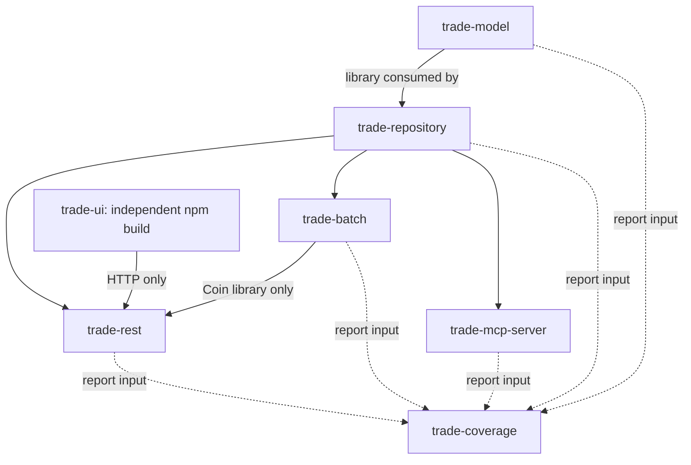
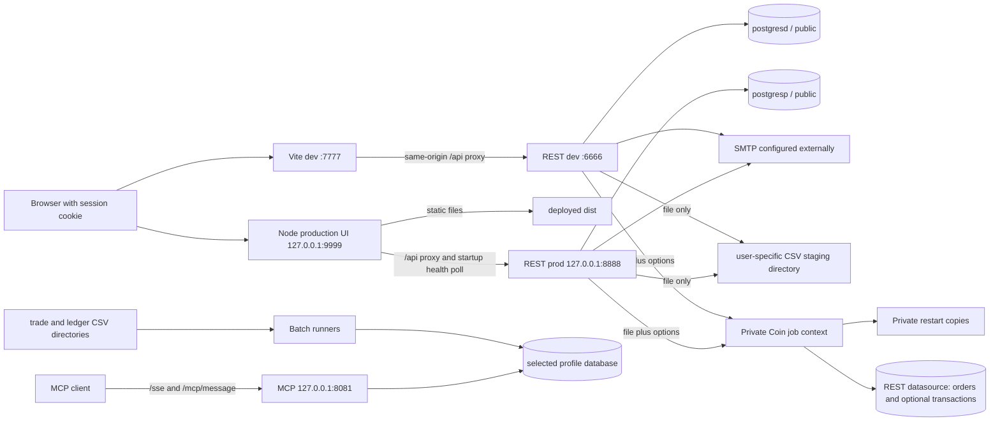

# Project understanding

Investigation: **6–7 October 2026**, Asia/Kolkata. Checkout: `/Users/abnig19/zerodha/trade-parent-reactor`. Branch: **main**. Investigated commit: **`70b9f2c2e8621ed396019c6378c1a61b019cf701`**. The checkout was clean before this investigation; the investigation produced this report and linked appendices. The subsequent retention instruction and knowledge log are recorded in the [learning log](project-understanding/LEARNING_LOG.md). One registered worktree was present. This is an implementation and troubleshooting handoff, not a deployment approval.

**Updated 9 October 2026:** the module/runtime descriptions include the Coin job
and upload integration on `feature/coin-batch-zerodha-upload`. The original inventory counts and live catalog
observations retain their 6–7 October scope; current test evidence is recorded in
the dated [verification entries](project-understanding/VERIFICATION.md#coin-upload-integration--9-october-2026).

## Reading map and evidence labels

| Appendix | Contents |
|---|---|
| [Data model](project-understanding/DATA_MODEL.md) | Every migration, all persisted columns, Java/JSON mappings, ERD, keys/indexes, source fidelity, live schema differences |
| [Components](project-understanding/COMPONENTS.md) | Backend inventory, callers/callees, ownership, transactions, errors and side effects |
| [Contracts and UI](project-understanding/CONTRACTS_AND_UI.md) | Every REST route and UI screen, request/response shapes, complete integration matrix, UI state/refresh behavior |
| [Workflows](project-understanding/WORKFLOWS.md) | Authentication, recovery, portfolio CRUD, uploads, financial formulas, batch and MCP contracts/flows |
| [Verification and coverage](project-understanding/VERIFICATION.md) | Fresh test results, safe execution boundaries, runtime observations, coverage limits and first-party file checklist |
| [Schema snapshot](project-understanding/SCHEMA_SNAPSHOT.json) | Read-only catalog evidence for configured development and production databases; no user/financial records or credentials |
| [Learning log](project-understanding/LEARNING_LOG.md) | Dated discoveries, decisions, corrections and verification from subsequent work |

**C — code-verified:** read in the investigated source/configuration. **T — test-verified:** exercised by existing checks run in this investigation. **R — runtime-verified:** directly observed process/artifact/catalog, limited to the observation described. **I — inferred:** consequence of code not reproduced in a running application. **U — unresolved:** needs an unavailable runtime, approved operational action, or product decision. Unless otherwise marked, descriptions below and in appendices are C. A source link includes the file and relevant line at this commit. Tests do not establish deployment correctness.

## Coverage checklist

- [x] Root instructions, all seven modules/builds, entry points and supporting scripts.
- [x] All 20 shared model/result/enum source files and all repository contracts/implementations.
- [x] All 13 migrations; 24 migration-defined tables; 168 final-schema columns; additional live Flyway history table.
- [x] All REST controllers, services, DTOs, security filters, validators, error handlers and configuration.
- [x] All REST route families, security-filter login/logout and health; callers and absent UI consumers identified.
- [x] Both batch pipelines from discovery through persistence and failure handling.
- [x] Four MCP tools, one resource, transports, SQL and packaging.
- [x] Every React screen, component, API helper, calculation helper, stylesheet and frontend test.
- [x] Profiles, development/production startup paths, LaunchAgents, logging and health behavior.
- [x] All existing test sources reviewed; backend and frontend checks executed; gaps explicitly recorded.
- [x] Database schema compared read-only with both configured databases, independently of migrations.
- [x] Data origins, transformations, owners, consumers and failure paths traced for each major data family.

The file-level checklist is in [Verification](project-understanding/VERIFICATION.md). Generated output, third-party implementation source and personal CSV exports were excluded from exhaustive source inspection. The original 6–7 October investigation changed no application code, dependencies, migrations or database contents. Subsequent Coin development changed source and tested jobs/migrations only in disposable test environments; no application database or deployed service was changed.

## Actual module structure

| Module | Responsibilities and public boundary | Build dependencies and consumers | Entry/configuration |
|---|---|---|---|
| `trade-model` | Plain mutual-fund/user/recovery/result objects; `TransactionType`; JPA trade/ledger entities; validation annotations | Data JPA and validation starters; consumed through repository by all three backends | No executable; [pom.xml:1](../trade-model/pom.xml#L1) |
| `trade-repository` | Repository interfaces, JDBC implementations and row maps, JPA trade/ledger contracts, migration resources | Model, Actuator, PostgreSQL driver; consumed by REST, batch, MCP | Component scan and explicit owner factory; [pom.xml:1](../trade-repository/pom.xml#L1) |
| `trade-rest` | Session-authenticated portfolio CRUD/analytics; registration, profile, recovery; Coin upload/import and legacy file staging | Repository, MVC, Security, Mail, Flyway; Coin-only batch library and Batch core; UI is HTTP consumer | `com.trading.TradeRestApplication`; [pom.xml](../trade-rest/pom.xml), [TradeRestApplication.java](../trade-rest/src/main/java/com/trading/TradeRestApplication.java) |
| `trade-batch` | Legacy global trade/ledger imports; isolated owner-scoped Coin CSV job | Repository and Batch; Coin library consumed by REST, no REST calls | Default TradeBatchApplication, separate Coin executable/library; [pom.xml](../trade-batch/pom.xml), [Coin runtime](../trade-batch/src/main/java/com/trading/coin/CoinImportRuntime.java) |
| `trade-mcp-server` | Four read tools and one symbol resource over SSE/WebFlux | Repository, Spring AI MCP/WebFlux and unused spring-ai-ollama dependency; no REST calls | Actual `com.trading.TradeMcpServerApplication`; POM names a different nonexistent class; [pom.xml:52](../trade-mcp-server/pom.xml#L52) |
| `trade-coverage` | POM-only aggregate JaCoCo HTML/XML report, no application behavior | Depends on all five Java modules for reporting; not a deployed component | Verify-phase `report-aggregate`; [pom.xml:1](../trade-coverage/pom.xml#L1) |
| `trade-ui` | Independent React SPA, client calculations, development proxy and production static/proxy server | npm React/ReactDOM; Vite/plugin in development; outside Maven reactor | `index.html` → `src/main.jsx` → `App`; [package.json:1](../trade-ui/package.json#L1), [vite.config.js:1](../trade-ui/vite.config.js#L1) |

Historical Eclipse metadata is already tracked and specifies Java25; no IDE files were added or removed. Supporting components are `scripts/verify-with-reports.sh`, `deploy/macos` templates/launchers and architecture/migration documents. Coin adds an order importer within the existing modules. No queue, scheduled worker, admin UI or external market-data client was found. SMTP is a real external integration. Spring AI/Ollama dependencies do not establish an implemented model invocation.

The reactor provides separate REST, batch and MCP executables. REST also embeds the Coin job through its narrow library, using a private Batch context per import. Legacy entry points scan `com.trading` with Coin exclusions; Coin configuration is explicitly registered. Shared JPA entities/repositories can initialize in REST, whose active portfolio access is JDBC. Portfolio controllers call repositories directly. Registration, profile, recovery and upload have their own services; there is no general portfolio service layer. [OwnedPortfolioConfiguration.java:21](../trade-rest/src/main/java/com/trading/security/OwnedPortfolioConfiguration.java#L21), [MutualFundController.java:66](../trade-rest/src/main/java/com/trading/controller/MutualFundController.java#L66), [CoinImportRuntime.java](../trade-batch/src/main/java/com/trading/coin/CoinImportRuntime.java)

## Runtime architecture

Coin uploads with explicit options now run the isolated mutual-fund job and may post completed transactions under the selected policy. File-only requests retain staging compatibility. REST/Coin portfolio data is owner-scoped through broker accounts; legacy batch/MCP trade and ledger data is global and has no user FK. [ZerodhaTransactionUploadService.java](../trade-rest/src/main/java/com/trading/upload/ZerodhaTransactionUploadService.java), [CoinImportRuntime.java](../trade-batch/src/main/java/com/trading/coin/CoinImportRuntime.java), [TradeMcpServerTools.java:1](../trade-mcp-server/src/main/java/com/trading/mcp/tools/TradeMcpServerTools.java#L1)

Production uses two per-user macOS LaunchAgents with `RunAtLoad` and `KeepAlive`. The UI waits for a successful health response before binding, then proxies API status/body/cookies unchanged. It does **not** continuously suspend itself when REST becomes unhealthy; later upstream connection failures yield 502. REST restart loses in-memory sessions. Production profile reset links default to localhost while deployment instructions direct the browser to127.0.0.1; these are different cookie origins and should be chosen consistently. There is no TLS termination in these templates. [com.trading.trade-rest.plist:1](../deploy/macos/com.trading.trade-rest.plist#L1), [com.trading.trade-ui.plist:1](../deploy/macos/com.trading.trade-ui.plist#L1), [serve-production.mjs:45](../trade-ui/scripts/serve-production.mjs#L45), [SecurityConfiguration.java:1](../trade-rest/src/main/java/com/trading/security/SecurityConfiguration.java#L1)

**R:** no project HTTP listeners were present during inspection; PostgreSQL was running on loopback. Consequently no application response, browser workflow, batch job or MCP handshake was treated as live-verified. The built REST JAR contains its manifest start class; the built MCP JAR does not. Packaging success alone missed that defect.

## Core data and policy boundaries

1. **Identity and access:** Spring Security form login establishes an HttpOnly `JSESSIONID`; CSRF applies to unsafe requests, including public registration/recovery. Each authenticated request rechecks account flags and credential version. Principal ID determines portfolio ownership; request owner fields cannot select another tenant. No admin API or role-based elevation is implemented. [SecurityConfiguration.java:28](../trade-rest/src/main/java/com/trading/security/SecurityConfiguration.java#L28), [CredentialVersionFilter.java:17](../trade-rest/src/main/java/com/trading/security/CredentialVersionFilter.java#L17), [OwnedPortfolioJdbc.java:1](../trade-repository/src/main/java/com/trading/repository/impl/OwnedPortfolioJdbc.java#L1)
2. **Portfolio facts:** brokers → funds → completed transactions and manually recorded valuations. The manual order repository links to an existing same-fund transaction without posting one; the Coin importer can post COMPLETE orders under an explicit transaction-date policy. Every completed transaction contributes regardless of descriptive status. Identifiers, metadata and dates have distinct preservation rules detailed in the dictionary. [V9__mutual_fund_orders.sql:1](../trade-repository/src/main/resources/db/migration/V9__mutual_fund_orders.sql#L1), [V11__move_order_metadata_to_transactions.sql:1](../trade-repository/src/main/resources/db/migration/V11__move_order_metadata_to_transactions.sql#L1), [OwnedTxnRepository.java:1](../trade-repository/src/main/java/com/trading/repository/impl/OwnedTxnRepository.java#L1)
3. **Financial calculations:** SQL produces owner-scoped portfolio aggregates; Java uses `BigDecimal` and six-place percentage rounding. Browser helpers compute individual-fund holdings, cash flows, XIRR/TWR and risk using JavaScript numbers and explicit missing-data rules. There is no NAV feed, pricing engine, tax lot engine or benchmark integration. [JdbcAnalyticsRepository.java:52](../trade-repository/src/main/java/com/trading/repository/impl/JdbcAnalyticsRepository.java#L52), [advancedReturnMetrics.js:1](../trade-ui/src/components/advancedReturnMetrics.js#L1), [holdingsBalances.js:1](../trade-ui/src/components/holdingsBalances.js#L1)
4. **Raw imported executions/ledger entries:** JPA writes CSV chunks into unowned tables. MCP queries them directly with no REST/session ownership context. Batch UUIDs are internal row keys, not source deduplication. [TradeRecordRepository.java:1](../trade-repository/src/main/java/com/trading/repository/impl/TradeRecordRepository.java#L1), [LedgerRecordRepository.java:1](../trade-repository/src/main/java/com/trading/repository/impl/LedgerRecordRepository.java#L1), [TradeFieldSetMapper.java:1](../trade-batch/src/main/java/com/trading/batch/reader/mapper/TradeFieldSetMapper.java#L1)
5. **Schema governance:** migrations specify intended structure, but Flyway is disabled in every application. Both accessible databases have only a baseline at version 1 and observable drift; do not enable migrations casually or infer history from column presence. See the [schema comparison](project-understanding/DATA_MODEL.md#live-schema-comparison).

## Configuration and startup guide

| Concern | Actual configuration |
|---|---|
| Java/Maven | Boot parent 4.0.6; source/target Java 25; Spring AI 1.1.5; JaCoCo 0.8.15. AGENTS says target 21 for new work but explicitly says not to incidentally change existing Java 25 POMs. No Maven wrapper. [pom.xml:1](../pom.xml#L1), [AGENTS.md:1](../AGENTS.md#L1) |
| Local verification tools | Java 25.0.2, Maven 3.9.15, Node 26.0.0 observed. Tests provision PostgreSQL 16 Alpine; accessible application databases are PostgreSQL 18.4 Homebrew. |
| Frontend versions | Manifest React `^19.1.1`, Vite `^7.1.3`, React plugin `^4.7.0`; lock resolves React/ReactDOM 19.2.8 and Vite 7.3.6. Vite lock engine requires Node `^20.19.0 || >=22.12.0`; no root npm engine declaration. [package-lock.json:1](../trade-ui/package-lock.json#L1), [package.json:1](../trade-ui/package.json#L1) |
| Profiles | Default Spring profile `dev`; Maven `-Pdev/-Pprod` supplies profile property to tests/Boot run. A packaged JAR still needs runtime `SPRING_PROFILES_ACTIVE`/CLI selection. [pom.xml:31](../pom.xml#L31), [application.properties:1](../trade-rest/src/main/resources/application.properties#L1) |
| Development | REST 6666; UI Vite 7777 proxies `/api` to localhost:6666; all backend dev datasources point to `postgresd`, public schema. [application-dev.properties:1](../trade-rest/src/main/resources/application-dev.properties#L1), [vite.config.js:1](../trade-ui/vite.config.js#L1) |
| Production | REST 8888; prod datasource `postgresp`, public; LaunchAgent adds loopback bind. UI Node defaults loopback 9999 → loopback 8888. Base REST config alone does not constrain bind address. [application-prod.properties:1](../trade-rest/src/main/resources/application-prod.properties#L1), [serve-production.mjs:1](../trade-ui/scripts/serve-production.mjs#L1) |
| Database credentials | `DB_USERNAME`, `DB_PASSWORD`; committed fallback credentials exist and must be replaced for deployment. Values deliberately omitted from this report. Standard `SPRING_DATASOURCE_*` runtime overrides can replace datasource properties. |
| Initialization | `spring.jpa.hibernate.ddl-auto=none`; Flyway disabled; batch/MCP SQL/Batch schema initialization disabled. Shared migrations `classpath:db/migration`. Baseline profile only sets baseline-on-migrate; base baseline-version is **1**, not documentation's 4. [application-flyway-baseline.properties:1](../trade-rest/src/main/resources/application-flyway-baseline.properties#L1), [application.properties:28](../trade-rest/src/main/resources/application.properties#L28) |
| Session | 30 minutes, HttpOnly, SameSite=Lax, cookie tracking only; `SESSION_COOKIE_SECURE` default false. REST has no configured cross-origin allowance; same-origin proxy is part of browser integration. |
| SMTP/recovery | External `SPRING_MAIL_HOST` needed; `SPRING_MAIL_PORT` default 587, `SPRING_MAIL_USERNAME`, `SPRING_MAIL_PASSWORD`, `SPRING_MAIL_PROPERTIES_MAIL_SMTP_AUTH`, `SPRING_MAIL_PROPERTIES_MAIL_SMTP_STARTTLS_ENABLE`; connect/read/write 5000 ms. `PASSWORD_RESET_FROM`, `PASSWORD_RESET_URL` (profile defaults: http://localhost:7777/reset-password in dev, localhost:9999 in prod; base default empty). URL must HTTPS or HTTP localhost, without query/fragment/userinfo. HTTP 127.0.0.1 production UI address is not accepted as a reset URL by this validator. [SmtpResetMailSender.java:23](../trade-rest/src/main/java/com/trading/recovery/SmtpResetMailSender.java#L23) |
| Upload | Legacy staging: `ZERODHA_TRANSACTIONS_UPLOAD_DIR`, default `/tmp/trade-zerodha-transaction-uploads`. Coin restart copies: `COIN_IMPORT_WORK_DIRECTORY`, default `${user.home}/.trade/coin-imports`. Multipart file/request caps 10 MB; synchronous imports with JSON options. See the [runbook](COIN_BATCH_RUNBOOK.md#rest-and-ui-integration--9-october-2026). |
| Batch | Input/skip/chunk/recursion/truncate options in [batch workflow](project-understanding/WORKFLOWS.md#batch-processing). Shared `CSV_INPUT_FILE` override affects both pipelines; archive/error properties unused. |
| MCP | Loopback8081, ASYNC, SSE `/sse`, messages `/mcp/message`; explicit Hikari 10 max/5 min, 30-second connection and idle settings; permissive CORS. Property `spring.ai.mcp.server.veersion` is misspelled. Resource capability/discovery requires runtime verification. |
| Logs/health | SLF4J; controller error advice warns for 4xx and logs stack traces for 5xx; recovery/profile have local handlers; batch listener reports counts/failures; verbose JDBC/Spring AI settings can be noisy. Public `/actuator/health`; other routes follow authentication policy. Coin V14 adds durable import audit tables; no telemetry exporter is configured. |

Configuration precedence for normal Spring startup is runtime arguments/environment over packaged properties; active profile properties override base files. Explicit MCP datasource bean reads configured values rather than creating an independent database. Launch scripts source an external environment file before `exec java`; templates contain artifact paths/profile/ports, not credentials. The scripts do not enforce the documented file mode 600. [McpConfig.java:29](../trade-mcp-server/src/main/java/com/trading/mcp/conf/McpConfig.java#L29), [launch-trade-rest.sh:1](../deploy/macos/launch-trade-rest.sh#L1), [launch-trade-ui.sh:1](../deploy/macos/launch-trade-ui.sh#L1)

Safe future development sequence (reference only; **application startup was not performed**): inspect database schema/history first; build/install reactor libraries using normal tests; run REST with `mvn -pl trade-rest spring-boot:run -Pdev` after dependencies are installed; run `npm --prefix trade-ui run dev`. For a packaged REST artifact set `SPRING_PROFILES_ACTIVE=dev` or `prod` explicitly and provide datasource/mail configuration externally. Build UI independently with `npm --prefix trade-ui run build`. Production scripts require the artifact layout under `~/Applications/trading`, external environment file, Java 25 and Node in their configured PATH. Deployment archive named in old documents is a generated historical artifact, not a tracked reproducible packaging script. Never use a batch startup merely to test the database connection: custom runners launch imports despite `spring.batch.job.enabled=false`.

## Confirmed inconsistencies and incomplete behavior

| Finding | Evidence/status | Consequence |
|---|---|---|
| Both live databases lack V12 broker uniqueness | **R**, catalog constraints/indexes; [V12__unique_broker_account_per_owner.sql:1](../trade-repository/src/main/resources/db/migration/V12__unique_broker_account_per_owner.sql#L1) | Duplicate prevention proved in isolated tests is absent there. No duplicate rows were inspected or fixed. |
| Flyway history is baseline1 only; runtime disabled | **C/R** | Column presence cannot prove ordered migrations; enabling Flyway requires reconciled history and schema first. |
| Production omits `vector_store`, UUID/vector extensions; development embedding is dimensioned while V4 says bare VECTOR | **R/C**, snapshot and [V4__spring_ai_schema.sql:1](../trade-repository/src/main/resources/db/migration/V4__spring_ai_schema.sql#L1) | Fresh V1–V4 installation remains untested; currently unused AI schema differs. |
| MCP executable start class invalid | **C/R**, POM and built manifest | `java -jar` launch cannot locate configured main class; Maven package success is insufficient. |
| Coin import requires explicit upload options and schema prerequisites | **C/T**, 9 October | Options run the job and return200/COMPLETED; file-only202 still means staged. Live V14/history readiness remains deployment work. |
| Recovery enrollment absent in React | **C** | Registration UI supplies no three-answer enrollment, profile hint is unrelated, and there is no enrollment screen/API helper. UI-created users need separate API enrollment to use question-based reset. |
| Table-wide batch delete can race across asynchronous files | **C/I** | Previously committed chunks may be erased, and a later failed import cannot restore earlier deletion. No batch runtime safety tests exist. |
| Both batch application classes are scanned runners | **C/I** | Treat either startup as potentially launching both imports; no isolated context test establishes otherwise. |
| MCP average tools return sums, not `avgPrice`; sequence tool uses unweighted AVG | **C** | Descriptions imply stronger financial semantics than implemented; trade count is discarded by result constructor. |
| “Latest valuation” differs between management overview and analytics | **C** | Management orders full timestamp descending then ID ascending; analytics collapses calendar day choosing highest ID. Same-day records can produce different totals. |
| Summary meanings differ | **C/T** | Transaction detail summary sums raw amount/units; fund overview uses net amounts; analytics uses signed cash flows and reliable units. These are not interchangeable holdings. |
| Frontend precision/error mismatch | **C/T** | SQL units/NAV support six decimals; transaction form step is .001 and some displays show two/three/four. API fieldErrors are discarded by client helper, leaving generic form feedback. |
| Metadata round-trips differ | **C/T** | Fund blank clears to NULL; transaction blank is literal empty string; both preserve old metadata for omitted/null updates. UI trims ISIN/name but not plan/folio/transaction metadata. |
| Missing-value totals differ | **C/T** | Value-management overview totals known snapshots; portfolio analytics declares total unavailable if any fund is unvalued. |
| UI broker selector fetches only first100 | **C** | Fund create/edit selection can omit later owned accounts. Analytics fund selector is complete. |
| No order REST API/UI; Coin import is standalone | **C/T (8 Oct)** | Coin now stages/imports orders and handles PROCESSING to COMPLETE; see the runbook. The REST upload can now execute Coin with an options part; file-only callers retain staging. Descriptive transaction status alone does not exclude transactions from analytics. |
| CRUD duplicate submission and multi-query consistency | **C/I** | No request idempotency/version checking; most CRUD forms do not disable save. Count/list and mutation/reread can observe concurrent changes. |
| Global unowned trade/ledger data and unscoped legacy repositories remain | **C** | REST protection depends on using owner-scoped interface beans. MCP does not inherit REST security. |
| Model/schema mismatches | **C/R** | Trade quantity is SQL decimal but Java Integer; several JPA mandatory fields are nullable in SQL; unused LedgerBalances lacks mandatory create timestamp. |
| Broken document links and stale architecture | **C** | README links absent `user-profile-management.md` and `password-reset-backend.md`; gap analysis links absent multi-user plan. Do not treat old “verified” labels as current evidence. |

Documentation reconciliation: early README/ARCHITECTURE sections incorrectly claim no auth/migrations/services/UI tests/production proxy/profiles and wrong REST launcher; later README sections contradict those claims. Current owner repositories fix active REST broker generated-key behavior while the legacy implementation still returns a row count. README's universal paged-collections statement excludes current analytics arrays/summaries. Its proxy8888 is now dev6666. V5 email uniqueness is extended by V8 case-insensitive index. The older fast-lane COUNT syntax concern was resolved by a read-only PostgreSQL18.4 synthetic-row probe; this does not verify MCP transport. The older multi-user gap analysis misses current credential-version revocation and PostgreSQL suites, but its admin/audit/ownership-backfill gaps still stand. ANALYTICS_PLAN's later implemented Phase1–4 sections align with code; early proposed response with units is illustrative, not the actual portfolio response. Coin schema notes accurately explain V10/V11/V13 source preservation; old test counts and abbreviated migration range are historical. Deployment docs overstate health waiting after a REST-only restart. [README.md:1](../README.md#L1), [ARCHITECTURE.md:1](../ARCHITECTURE.md#L1), [multi-user-support-gap-analysis.md:1](../multi-user-support-gap-analysis.md#L1), [ANALYTICS_PLAN.md:1](../ANALYTICS_PLAN.md#L1), [coin-order-schema.md:1](../coin-order-schema.md#L1), [DEPLOYMENT_ARCHITECTURE.md:1](../DEPLOYMENT_ARCHITECTURE.md#L1)

## Verification outcome and readiness

**T:** `mvn -o verify -Pdev` passed the entire seven-project reactor: **211 tests, zero failures/errors/skips**, including isolated PostgreSQL suites. **T:** frontend **114 tests passed, zero failures/skips**; production Vite build passed. Plists passed lint and launchers/report helper passed shell syntax checks. Initial sandbox runs failed on Mockito attach, Docker and loopback listening; authorized reruns outside the sandbox passed. See [Verification](project-understanding/VERIFICATION.md) for exact commands, dates and per-suite results.

This establishes readiness to trace and implement changes across the existing layers without repeating repository-answerable questions. It does **not** establish a working deployed application, a fresh complete V1–V13 migration, batch execution or MCP transport. There was no running project listener to inspect, and service start/import/deployment was out of scope. SMTP delivery, browser event flows/accessibility, MCP schema discovery, batch bean wiring and import concurrency remain unverified at runtime.

Remaining decisions cannot be recovered from code: source order deduplication/matching and lifecycle policy; ownership backfill for unassigned accounts; admin permissions/audit policy; whether MCP is strictly local and how to define its average/owned-position semantics; source CSV timezone/header/rejection policy; benchmark provider. Routine field/API/UI work need not wait for these unless it changes that boundary. Migration reconciliation and missing V12 enforcement require a separate approved database task.

## Change-impact guide

| Change | Layers/contracts to inspect together | Required focused verification |
|---|---|---|
| Persisted portfolio field | New immutable migration; model; both legacy and owned JDBC SQL/mappers; DTO/date conversion; UI API/form/rendering; dictionary | PostgreSQL persistence/migration tests, DTO/controller tests, owner isolation, UI payload/render tests |
| Broker/fund ownership or parent relation | V6/V9/V12 FKs; factory/request-scope wiring; SQL predicates on read/count/write/new parent; validator | Two-owner direct and filtered CRUD, unknown/foreign parents, reassignment/delete references, PostgreSQL constraints |
| Transaction status/source metadata | V11 TEXT semantics, null/empty preservation, enum direction kept separate, DTO, form/details | Leading zeros/N/A/shared IDs/raw JSON/whitespace, legacy omissions, every response route; confirm totals unchanged |
| Financial rule | SQL summaries/portfolio CTE + Java rounding; investment/holdings/cash/returns JS helpers; input semantics and labels | Hand-worked BUY/SELL examples, same-day order, missing/negative data, ranges and snapshot selection, PostgreSQL portfolio + UI calculations |
| Endpoint/response/date format | Controller/filter, DTO/advice/status codes, api.js, every caller, proxy if path changes | Actual JSON contract tests, CSRF/session/ownership, all page vs array callers, date-only/ISO distinctions and errors |
| Authentication/profile/recovery | Security principal/version filter; transaction locks; credential-safe models; repositories/migrations; mail; UI routes/forms | H2 and PostgreSQL concurrency/rollback tests; cookie+CSRF; disabled/reset sessions; byte-length and privacy; controlled SMTP/browser test separately |
| CSV format/import behavior | Discovery config; positional tokenizer/mapper; JPA annotations/SQL; chunk/skip/transactions; listener and file lifecycle | New isolated batch context/mapper/job tests needed; duplicate/header/partial failures; multi-file truncate cannot be inferred from compile |
| Zerodha upload to actual import | Current staging boundary; owner propagation; file validation/queue/restart/dedupe contract; order vs transaction reconciliation | Current upload tests only prove staging. New job/persistence/failure/status tests and explicit source policies required |
| UI workflow | App mount/session generation; component effect cleanup; API helper; server contract; shared dates/styles/calculations | Node/SSR/API tests and build; browser tests required for real events, focus, stale requests and layout |
| Build/deployment/profile | Parent/child POMs, independent npm lock/build, Boot start class, env files, proxy/health, migration state | Full verify; fresh artifact manifest/class check; npm test/build; plist/shell validation; approved deployment runtime checks separately |
| MCP contract | Tool/resource annotations/schema discovery; result DTO; JPA/native SQL; transport/security/CORS | Add isolated tool/SQL/transport tests; obtain approval for breaking MCP API changes per AGENTS |

## Keeping this understanding current

At the user's request on 7 October 2026, every subsequent task should consult this report and the relevant appendices, verify the facts it relies on, and retain material new learning before completion. The standing procedure is in [AGENTS.md](../AGENTS.md#retaining-project-knowledge). Update the affected descriptions and add a concise entry to the [learning log](project-understanding/LEARNING_LOG.md); a log entry alone does not correct a stale contract or data dictionary.

Date new evidence and identify its checkout/commit, relevant uncommitted changes, verification scope and remaining uncertainty. Existing test results and schema snapshots describe the investigation above; they must not be silently re-labelled as current runtime evidence. Keep credentials and private records out of all retained knowledge.

## Coin CSV import specification — 7 October 2026 (historical design)

The [analysis prompt](COIN_ORDER_HISTORY_ANALYSIS_PROMPT.md) and
[proposed batch requirements](COIN_ORDER_HISTORY_BATCH_REQUIREMENTS.md) map all
source fields to the current schema and describe an additive staging/import
design. This is documentation-only work: no importer, migration or runtime
integration was implemented. Proposed ORDER_ONLY ingestion, existing-master
matching and deferred reconciliation are recommendations, not approved business
policy. See the specification's decision table before implementation or posting.

The later 7 October refresh reprofiled the actual CSV without retaining private
records and rechecked the four relevant mutual-fund tables plus Batch columns in
both configured databases read-only. V10/V11/V13 layout is present; V12 uniqueness
is still absent and Flyway history remains baseline1 only. These catalog checks
do not establish master matching/backfill correctness. **C:** offline dependency
resolution confirms Batch 6.0.3, whose `@EnableBatchProcessing` defaults to a
resourceless repository; no explicit JDBC repository configuration was found in
the batch source. Durable Coin restart therefore requires explicit JDBC Batch
infrastructure and isolated context/restart tests. No runner was started.

The 8 October documentation handoff confirmed the source checksum and mapping
coverage and tightened startup isolation in both directions: legacy entry points
must also exclude proposed Coin components from their broad component scans.
See the [startup requirements](COIN_ORDER_HISTORY_BATCH_REQUIREMENTS.md#6-proposed-spring-batch-contract)
and [learning entry](project-understanding/LEARNING_LOG.md#2026-10-08--coin-requirements-handoff-completed).
No importer was implemented; catalog observations above remain dated 7 October,
and no application tests or database operations ran during this continuation.

**User requirement, 8 October:** the Coin design now also requires a
`coin_import_period` table at user/fund level to prevent repeat period loads.
The [period-tracking contract](COIN_ORDER_HISTORY_BATCH_REQUIREMENTS.md#user-and-mutual-fund-period-tracking)
defines the proposed columns, atomic reservations, blocking states and restart
rules. Rejecting any overlap and requiring declared export dates remain proposed
defaults pending confirmation. This supersedes the design's earlier two-table
scope and automatic staging of every overlapping export, not the existing
application: no table or importer has been created/applied by this update.

## Coin batch implementation — 8 October 2026

**C/T:** the user subsequently requested the actual batch job, component tests,
validation of all input records and PROCESSING-to-COMPLETE upserts. The uncommitted
implementation now spans model POJOs, the JDBC repository, additive V14 migration,
and an isolated batch launcher. See the [runbook](COIN_BATCH_RUNBOOK.md) for current
contracts, explicit launch parameters, migration prerequisites and recovery.
This supersedes the no-implementation statements in the dated design section above.

`coinOrderHistoryImportJob` uses explicit JDBC Batch infrastructure and transactional
stage/project/finalize steps. Five audit/identity/period tables preserve source
snapshots and prevent repeat loads. Completion files can reuse exact loaded
periods for known orders; unchanged funds may accompany another fund's completion.
No new orders or partial overlaps are permitted in covered fund/periods.

Date parsing and transaction posting require explicit choices. ORDER_ONLY changes
no portfolio transactions. A selected posting policy creates a linked transaction
once for a COMPLETE row with valid positive BUY/SELL facts. No masters are created;
ambiguous/manual matches need reconciliation. At this 8 October stage the upload endpoint still only staged files; the
9 October integration below supersedes that boundary.

**T:** 47 Coin tests passed, including real PostgreSQL constraints/concurrency,
source fidelity, completion/posting/replay, rollback, standalone modes, and restart
in a new JVM. Both packaged entry points were checked. Full regression evidence is
recorded in [Verification](project-understanding/VERIFICATION.md#coin-batch-implementation--8-october-2026).
No application database was connected, migrated or imported, and no running
application was restarted. V12/live migration-history reconciliation remains a
deployment prerequisite; the earlier catalog observations retain their dates.

## Coin upload integration — 9 October 2026

**C/T:** `POST /api/mutual-fund-txns/zerodha-upload` now accepts `file` plus optional
JSON `options` (account, period bounds, source date format, posting policy and fund
matches). The signed-in owner is supplied by REST. With options it validates and
runs the existing Coin job synchronously, returning200/COMPLETED with persisted
counts. File-only requests retain202/UPLOADED staging compatibility. The updated
Transactions form supplies the options, displays diagnostics/counts and refreshes
rows/totals. See the [runbook contract](COIN_BATCH_RUNBOOK.md#rest-and-ui-integration--9-october-2026).

The scoped integration adds a REST dependency on the Coin-only library classifier;
no legacy runners or standalone Boot main enter the REST artifact. Batch core is
used without Boot Batch auto-configuration. A private Coin context borrows the
REST datasource and closes without closing its pool. Repository SQL/module
ownership is unchanged. Per-process admission is bounded to one web import;
existing DB locks/identity/period constraints protect retries and other processes.

Tests include actual authenticated multipart HTTP against a temporary server and
disposable PostgreSQL, CSRF, ownership, completion/replay, safe errors and failure
restart. See [Verification](project-understanding/VERIFICATION.md#coin-upload-integration--9-october-2026)
for executed counts and limits. V14 remains unapplied to application DBs; no live
import, migration, service restart, deployment or commit was performed.
