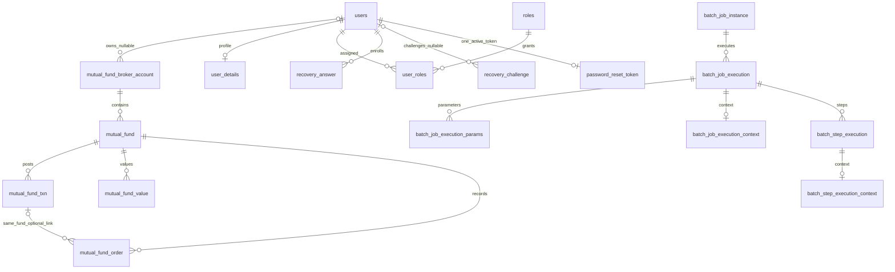

# Data model, source fidelity and schema evidence

[Main report](../PROJECT_UNDERSTANDING.md). Commit `70b9f2c2e8621ed396019c6378c1a61b019cf701`; investigated 6–7 October 2026. **C** unless marked **R/T/I/U**. The intended final schema below is the composition of V1–V13, not a claim that either running database executed that chain.

## Entity relationships and access

All drawn relationships are SQL FKs in migrations; cardinalities describe permitted schema states, not mandatory application completeness. Users may lack details/roles in externally modified data even though registration creates both. Orders allow many orders to reference one transaction; the composite FK enforces the same fund. No auto-reconciliation or one-order/one-fill constraint exists. Funds have one optional folio each, not a separate folio entity. No relationship joins trade-record ISIN to fund ISIN, ledger to broker/user, or vector/chat tables to users. `trade_records`, `ledger_records`, unused `ledger_balances`, `recovery_rate_limit`, `spring_ai_chat_memory` and `vector_store` are standalone relative to this ERD. [V3__application_schema.sql:1](../../trade-repository/src/main/resources/db/migration/V3__application_schema.sql#L1), [V5__create_app_user.sql:1](../../trade-repository/src/main/resources/db/migration/V5__create_app_user.sql#L1), [V6__portfolio_ownership.sql:1](../../trade-repository/src/main/resources/db/migration/V6__portfolio_ownership.sql#L1), [V7__password_recovery.sql:1](../../trade-repository/src/main/resources/db/migration/V7__password_recovery.sql#L1), [V9__mutual_fund_orders.sql:1](../../trade-repository/src/main/resources/db/migration/V9__mutual_fund_orders.sql#L1)

Portfolio FKs use default NO ACTION deletion/update behavior: a broker with funds, fund with children, user with owned brokers, or transaction referenced by orders cannot simply be deleted. There is no soft-delete flag, cascading portfolio API operation or transfer-user API. User details, user-role rows, recovery answers/challenges/tokens cascade when their referenced user is deleted; user-role mappings also cascade with role deletion. There is no user/role delete API. Batch metadata FKs have no cascade; the parameter table has no primary key. No database row-level security is specified by migrations; REST ownership is SQL predicates in the application.

## Migration ledger

| Version | Objects/change | Data/migration implications |
|---|---|---|
| [V1__extensions.sql:1](../../trade-repository/src/main/resources/db/migration/V1__extensions.sql#L1) | `uuid-ossp`, `vector` extensions | Requires installed extension support/privilege; not ordinary business records |
| [V2__spring_batch_schema.sql:1](../../trade-repository/src/main/resources/db/migration/V2__spring_batch_schema.sql#L1) | Six Batch tables, three sequences, keys | Framework execution metadata; sequence values generated outside identity columns |
| [V3__application_schema.sql:1](../../trade-repository/src/main/resources/db/migration/V3__application_schema.sql#L1) | Ledger balances/records, trades, brokers/funds/transactions/values | Base SQL constraints differ from several JPA annotations; no owner yet |
| [V4__spring_ai_schema.sql:1](../../trade-repository/src/main/resources/db/migration/V4__spring_ai_schema.sql#L1) | Chat memory, vector store, HNSW cosine index | No current first-party consumer; embedding has no dimension in migration; full fresh migration not tested |
| [V5__create_app_user.sql:1](../../trade-repository/src/main/resources/db/migration/V5__create_app_user.sql#L1) | Roles/users/details/join; seed ROLE_USER | `IF NOT EXISTS` adopts only already-compatible structures; does not repair mismatched existing tables |
| [V6__portfolio_ownership.sql:1](../../trade-repository/src/main/resources/db/migration/V6__portfolio_ownership.sql#L1) | Nullable broker `owner_user_id` FK; four access-path indexes | No backfill; ownerless data hidden from REST; not proof every broker has an owner |
| [V7__password_recovery.sql:1](../../trade-repository/src/main/resources/db/migration/V7__password_recovery.sql#L1) | User versions, answers/challenges/tokens/rate counters | Existing users have no automatic recovery answers; expiry is application-enforced |
| [V8__user_profile_hint.sql:1](../../trade-repository/src/main/resources/db/migration/V8__user_profile_hint.sql#L1) | Separate hint question/hash pair; unique LOWER(email) | Existing case-insensitive duplicates block migration; profile hint does not enroll recovery |
| [V9__mutual_fund_orders.sql:1](../../trade-repository/src/main/resources/db/migration/V9__mutual_fund_orders.sql#L1) | Fund ISIN/plan; txn units/NAV numeric21,6; orders and same-fund link | Original ISIN 12-character check later removed; widening retains 15 integer digits; no backfill/posting |
| [V10__move_folio_to_mutual_fund.sql:1](../../trade-repository/src/main/resources/db/migration/V10__move_folio_to_mutual_fund.sql#L1) | Folio moves order → fund | Distinct non-null order folios per fund must agree; scalar subquery fails otherwise; rollback preserves source |
| [V11__move_order_metadata_to_transactions.sql:1](../../trade-repository/src/main/resources/db/migration/V11__move_order_metadata_to_transactions.sql#L1) | Five TEXT metadata fields move order → linked txn | Temporary constraint rejects unlinked non-null metadata; per-field DISTINCT conflicts reject; same-value and complementary fields combine; no transaction invented; old order columns dropped |
| [V12__unique_broker_account_per_owner.sql:1](../../trade-repository/src/main/resources/db/migration/V12__unique_broker_account_per_owner.sql#L1) | UNIQUE broker_name/account_id/owner | Standard case/space-sensitive comparison, NULL owners distinct; duplicates fail rather than merge |
| [V13__relax_mutual_fund_isin_length.sql:1](../../trade-repository/src/main/resources/db/migration/V13__relax_mutual_fund_isin_length.sql#L1) | ISIN becomes optional TEXT, exact-length check removed | N/A/long values legal; no cleanup/normalization of existing source strings |

**T:** current PostgreSQL tests cover V9–V13 upgrade paths, V10/V11 rollback and V12 duplicate refusal. V1–V4 fresh-install behavior is not covered. Applied migrations must remain immutable; a new database change is a separate task.

## Value provenance and normalization

| Data | Origin → stored form → consumers | Omitted / explicit null / empty / whitespace |
|---|---|---|
| Broker name/account ID | UI/manual API → varchar → owner CRUD/fund labels/portfolio | No Bean Validation on broker body. Missing/null fails SQL NN; empty or spaces can persist. IDs remain String so leading zeros survive. V12 uniqueness uses exact stored text. |
| Fund name/parent | UI/manual API → required name/owned broker FK → CRUD/analytics | API name NotBlank; UI trims name. Parent positive and must be visible to owner. Not a globally unique scheme/security identifier. |
| Fund ISIN/plan/folio | Optional source facts → nullable TEXT → fund forms/table | Create missing/null/`""` → SQL NULL. Update missing/null preserves old field; `""` clears to SQL NULL. Spaces are preserved in SQL; UI trims ISIN, not plan/folio. N/A is literal valid text. |
| Completed txn numeric/direction/date | UI/API → BigDecimal/BUY-or-SELL/date at midnight → summaries/holdings/returns | Amount/units/avgPrice required and >=0 at HTTP boundary. Omitted and explicit null both invalid; zero is legal. Direction missing/null/lowercase/arbitrary invalid JSON enum. No amount=units×price or oversell validation. |
| Txn metadata | Optional status/reference/remarks/tag → TEXT → DTO/details | Create missing/null → NULL, empty preserved. Update missing/null preserves; empty stored verbatim (cannot clear to SQL NULL through this PUT). No trimming/case/status vocabulary/JSON parsing. IDs may repeat across transactions, include leading zeros or N/A. |
| Order fields | Repository callers only; independent order facts → nullable SQL fields | No REST validation because no order API. Null update replaces nullable order facts with NULL. Unknown direction, zero, missing details remain source values; no lifecycle inference. |
| Valuation | Manual UI/API → total amount/date → management and analytics snapshots | Both required; amount >=0 through API. No unique fund/day or NAV-derived calculation. Missing snapshot is different from recorded zero. |
| User/profile | Registration + profile UI/API → users/details → safe profile/session | Registration constraints differ from profile normalization. Profile optional basics null/omitted/blank → NULL; nonblank strip. Hint absent/null pair preserves; supplying one without the other invalid. Unknown profile properties/query params rejected. Email not stripped by profile service. |
| Recovery answer | Three user answers → NFKC + strip + lowercase + SHA-256 + BCrypt → answer checks only | Three unique question IDs needed; answers NotBlank/max256. Hashes never JSON responses. Separate single profile hint hashes exact raw text via SHA-256 + BCrypt. |
| Trade CSV | Positional source → trim-to-null text, numeric/date parsing → JPA → MCP | String order ID keeps zeros; Long trade ID/Integer quantity do not preserve numeric formatting. N/A/blank numeric/date fails parse. Trade type requires lower-case buy/sell. |
| Ledger CSV | Positional source → mapped text/numbers/date + generated absolute filename/time → JPA → MCP | Mapper parses net balance even though SQL allows NULL. Whitespace text stripped; no source-text fidelity guarantee as in fund metadata. |

Evidence: [OwnedFundRepository.java:34](../../trade-repository/src/main/java/com/trading/repository/impl/OwnedFundRepository.java#L34), [OwnedTxnRepository.java:55](../../trade-repository/src/main/java/com/trading/repository/impl/OwnedTxnRepository.java#L55), [OwnedOrderRepository.java:33](../../trade-repository/src/main/java/com/trading/repository/impl/OwnedOrderRepository.java#L33), [MutualFundTxnDto.java:1](../../trade-rest/src/main/java/com/trading/dto/MutualFundTxnDto.java#L1), [MutualFundValueDto.java:1](../../trade-rest/src/main/java/com/trading/dto/MutualFundValueDto.java#L1), [UserProfileService.java:46](../../trade-rest/src/main/java/com/trading/profile/UserProfileService.java#L46), [PasswordRecoveryService.java:50](../../trade-rest/src/main/java/com/trading/recovery/PasswordRecoveryService.java#L50), [TradeFieldSetMapper.java:19](../../trade-batch/src/main/java/com/trading/batch/reader/mapper/TradeFieldSetMapper.java#L19), [LedgerRecordFieldSetMapper.java:17](../../trade-batch/src/main/java/com/trading/batch/reader/mapper/LedgerRecordFieldSetMapper.java#L17), [MutualFunds.jsx:56](../../trade-ui/src/components/MutualFunds.jsx#L56), [MutualFundTransactions.jsx:156](../../trade-ui/src/components/MutualFundTransactions.jsx#L156).

Dates: persistence portfolio/trade audit columns are `TIMESTAMP WITHOUT TIME ZONE` and Java `LocalDateTime`; order day/time are independent LocalDate/LocalTime, with no inferred zone. HTTP txn/value DTOs accept strict English `dd-MMM-uuuu`, ISO date or ISO timestamp, retain its calendar date and store midnight; supplied offset is not converted to another zone. Read responses use `DD-Mon-YYYY`; analytics value history returns the model's ISO local timestamp instead. User/recovery SQL uses timestamptz, with recovery expiry passed as `Instant`/`Timestamp.from`; profile/user audit timestamps are not exposed by safe models. [MutualFundTxnDto.java:44](../../trade-rest/src/main/java/com/trading/dto/MutualFundTxnDto.java#L44), [MutualFundValueDto.java:31](../../trade-rest/src/main/java/com/trading/dto/MutualFundValueDto.java#L31), [JdbcPasswordRecoveryRepository.java:63](../../trade-repository/src/main/java/com/trading/repository/impl/JdbcPasswordRecoveryRepository.java#L63), [date.js:1](../../trade-ui/src/utils/date.js#L1)

Precision: monetary txn/order/value amounts numeric(18,2), units and NAV numeric(21,6), raw trade/ledger values numeric(15,6). BigDecimal passes directly to SQL; there is no explicit common rounding policy before persistence, so the database coerces to declared scale or rejects overflow. Analytics percentages explicitly use HALF_UP to scale6; JavaScript Number arithmetic and locale formatting are not exact decimal storage. Numeric JSON is unquoted; Long IDs can exceed browser safe integer precision in principle. UI displays often round without changing stored values, but transaction input step .001 prevents normal six-place input. Source values beyond six fractional places are not losslessly supported. [JdbcAnalyticsRepository.java:12](../../trade-repository/src/main/java/com/trading/repository/impl/JdbcAnalyticsRepository.java#L12), [MutualFundTransactions.jsx:152](../../trade-ui/src/components/MutualFundTransactions.jsx#L152), [advancedReturnMetrics.js:11](../../trade-ui/src/components/advancedReturnMetrics.js#L11)

Audit defaults are insertion defaults, not update triggers. JDBC portfolio updates explicitly set update_date; ignored client audit fields cannot rewrite stored creation time. Valuations have **no create/update audit columns**. Raw trade constructor assigns createdAt; ledger processor assigns createDateTime. No audit actor/action trail exists. **R:** neither inspected database had public-schema triggers.

## Column dictionary

`NN` = NOT NULL; `NULL` = nullable; blank default means none. JSON names are exact source bean/record property names where exposed. “internal” means no current public JSON contract; Batch/AI columns have no first-party mapped Java DTO. Keys/checks and explicit non-PK indexes follow the tables. Dictionary columns were reconciled with every migration and the catalog; known differences are isolated in the live comparison.
### `mutual_fund_broker_account`

Schema: [V3__application_schema.sql:1](../../trade-repository/src/main/resources/db/migration/V3__application_schema.sql#L1), [V6__portfolio_ownership.sql:1](../../trade-repository/src/main/resources/db/migration/V6__portfolio_ownership.sql#L1), [V12__unique_broker_account_per_owner.sql:1](../../trade-repository/src/main/resources/db/migration/V12__unique_broker_account_per_owner.sql#L1). Model: [MutualFundBrokerAccount.java:1](../../trade-model/src/main/java/com/trading/model/MutualFundBrokerAccount.java#L1).

| Column | SQL type | Null/default/generation | Java property/type | JSON representation |
|---|---|---|---|---|
| `broker_account_id` | bigint | NN; identity BY DEFAULT | Long id | `id`: number |
| `broker_name` | character varying(255) | NN | String brokerName | `brokerName`: string |
| `account_id` | character varying(100) | NN | String accountId | `accountId`: string |
| `create_date` | timestamp without time zone | NN; default CURRENT_TIMESTAMP | LocalDateTime createDate | `createDate`: string ISO date/time |
| `update_date` | timestamp without time zone | NN; default CURRENT_TIMESTAMP | LocalDateTime updateDate | `updateDate`: string ISO date/time |
| `owner_user_id` | bigint | NULL | long ownerId in bound repository | not exposed in broker model |

Keys/checks: `PRIMARY KEY (broker_account_id)`; `FOREIGN KEY (owner_user_id) REFERENCES users(id)`; `UNIQUE (broker_name, account_id, owner_user_id) — V12 intended; absent in live catalogs`.

### `mutual_fund`

Schema: [V3__application_schema.sql:1](../../trade-repository/src/main/resources/db/migration/V3__application_schema.sql#L1), [V9__mutual_fund_orders.sql:1](../../trade-repository/src/main/resources/db/migration/V9__mutual_fund_orders.sql#L1), [V10__move_folio_to_mutual_fund.sql:1](../../trade-repository/src/main/resources/db/migration/V10__move_folio_to_mutual_fund.sql#L1), [V13__relax_mutual_fund_isin_length.sql:1](../../trade-repository/src/main/resources/db/migration/V13__relax_mutual_fund_isin_length.sql#L1). Model: [MutualFund.java:1](../../trade-model/src/main/java/com/trading/model/MutualFund.java#L1).

| Column | SQL type | Null/default/generation | Java property/type | JSON representation |
|---|---|---|---|---|
| `mutual_fund_id` | bigint | NN; identity ALWAYS | Long mutualFundId | `mutualFundId`: number |
| `broker_account_id` | bigint | NN | Long brokerAccountId | `brokerAccountId`: number |
| `mutual_fund_name` | character varying(255) | NN | String mutualFundName | `mutualFundName`: string |
| `create_date` | timestamp without time zone | NN; default CURRENT_TIMESTAMP | LocalDateTime createDate | `createDate`: string ISO date/time |
| `update_date` | timestamp without time zone | NN; default CURRENT_TIMESTAMP | LocalDateTime updateDate | `updateDate`: string ISO date/time |
| `isin` | text | NULL | String isin | `isin`: string |
| `plan` | text | NULL | String plan | `plan`: string |
| `folio_number` | text | NULL | String folioNumber | `folioNumber`: string |

Keys/checks: `FOREIGN KEY (broker_account_id) REFERENCES mutual_fund_broker_account(broker_account_id)`; `PRIMARY KEY (mutual_fund_id)`.

### `mutual_fund_txn`

Schema: [V3__application_schema.sql:1](../../trade-repository/src/main/resources/db/migration/V3__application_schema.sql#L1), [V9__mutual_fund_orders.sql:1](../../trade-repository/src/main/resources/db/migration/V9__mutual_fund_orders.sql#L1), [V11__move_order_metadata_to_transactions.sql:1](../../trade-repository/src/main/resources/db/migration/V11__move_order_metadata_to_transactions.sql#L1). Model: [MutualFundTxn.java:1](../../trade-model/src/main/java/com/trading/model/MutualFundTxn.java#L1).

| Column | SQL type | Null/default/generation | Java property/type | JSON representation |
|---|---|---|---|---|
| `mutual_fund_txn_id` | bigint | NN; identity ALWAYS | Long mutualFundTxnId | `mutualFundTxnId`: number |
| `mutual_fund_id` | bigint | NN | Long mutualFundId | `mutualFundId`: number |
| `amount` | numeric(18,2) | NN | BigDecimal amount | `amount`: number |
| `create_date` | timestamp without time zone | NN; default CURRENT_TIMESTAMP | LocalDateTime createDate | `createDate`: string ISO date/time |
| `update_date` | timestamp without time zone | NN; default CURRENT_TIMESTAMP | LocalDateTime updateDate | `updateDate`: string ISO date/time |
| `txn_date` | timestamp without time zone | NN | LocalDateTime txnDate | `txnDate`: string DD-Mon-YYYY |
| `units` | numeric(21,6) | NN; default 0 | BigDecimal units | `units`: number |
| `avg_price` | numeric(21,6) | NN; default 0 | BigDecimal avgPrice | `avgPrice`: number |
| `txn_type` | character varying | NN; default 'BUY'::character varying | TransactionType transactionType | `transactionType`: string BUY/SELL |
| `status` | text | NULL | String status | `status`: string |
| `exchange_order_id` | text | NULL | String exchangeOrderId | `exchangeOrderId`: string |
| `remarks` | text | NULL | String remarks | `remarks`: string |
| `tag` | text | NULL | String tag | `tag`: string |
| `settlement_id` | text | NULL | String settlementId | `settlementId`: string |

Keys/checks: `FOREIGN KEY (mutual_fund_id) REFERENCES mutual_fund(mutual_fund_id)`; `PRIMARY KEY (mutual_fund_txn_id)`; `UNIQUE (mutual_fund_txn_id, mutual_fund_id)`.

### `mutual_fund_value`

Schema: [V3__application_schema.sql:1](../../trade-repository/src/main/resources/db/migration/V3__application_schema.sql#L1). Model: [MutualFundValue.java:1](../../trade-model/src/main/java/com/trading/model/MutualFundValue.java#L1).

| Column | SQL type | Null/default/generation | Java property/type | JSON representation |
|---|---|---|---|---|
| `val_id` | bigint | NN; identity ALWAYS | Long valId | `valId`: number |
| `mutual_fund_id` | bigint | NN | Long mutualFundId | `mutualFundId`: number |
| `total_value` | numeric(18,2) | NN | BigDecimal totalValue | `totalValue`: number |
| `value_as_of_date` | timestamp without time zone | NN | LocalDateTime valueAsOfDate | `valueAsOfDate`: string DD-Mon-YYYY; analytics model timestamp ISO |

Keys/checks: `FOREIGN KEY (mutual_fund_id) REFERENCES mutual_fund(mutual_fund_id)`; `PRIMARY KEY (val_id)`.

### `mutual_fund_order`

Schema: [V9__mutual_fund_orders.sql:1](../../trade-repository/src/main/resources/db/migration/V9__mutual_fund_orders.sql#L1), [V10__move_folio_to_mutual_fund.sql:1](../../trade-repository/src/main/resources/db/migration/V10__move_folio_to_mutual_fund.sql#L1), [V11__move_order_metadata_to_transactions.sql:1](../../trade-repository/src/main/resources/db/migration/V11__move_order_metadata_to_transactions.sql#L1). Model: [MutualFundOrder.java:1](../../trade-model/src/main/java/com/trading/model/MutualFundOrder.java#L1).

| Column | SQL type | Null/default/generation | Java property/type | JSON representation |
|---|---|---|---|---|
| `mutual_fund_order_id` | bigint | NN; identity ALWAYS | Long mutualFundOrderId | `mutualFundOrderId`: number; no direct HTTP endpoint |
| `mutual_fund_id` | bigint | NN | Long mutualFundId | `mutualFundId`: number; no direct HTTP endpoint |
| `mutual_fund_txn_id` | bigint | NULL | Long mutualFundTxnId | `mutualFundTxnId`: number; no direct HTTP endpoint |
| `txn_type` | character varying | NULL | String transactionType | `transactionType`: string; no direct HTTP endpoint |
| `trade_date` | date | NULL | LocalDate tradeDate | `tradeDate`: string ISO date/time; no direct HTTP endpoint |
| `ordered_at` | time without time zone | NULL | LocalTime orderedAt | `orderedAt`: string ISO date/time; no direct HTTP endpoint |
| `amount` | numeric(18,2) | NULL | BigDecimal amount | `amount`: number; no direct HTTP endpoint |
| `units` | numeric(21,6) | NULL | BigDecimal units | `units`: number; no direct HTTP endpoint |
| `avg_price` | numeric(21,6) | NULL | BigDecimal avgPrice | `avgPrice`: number; no direct HTTP endpoint |
| `create_date` | timestamp without time zone | NN; default CURRENT_TIMESTAMP | LocalDateTime createDate | `createDate`: string ISO date/time; no direct HTTP endpoint |
| `update_date` | timestamp without time zone | NN; default CURRENT_TIMESTAMP | LocalDateTime updateDate | `updateDate`: string ISO date/time; no direct HTTP endpoint |

Keys/checks: `FOREIGN KEY (mutual_fund_txn_id, mutual_fund_id) REFERENCES mutual_fund_txn(mutual_fund_txn_id, mutual_fund_id)`; `FOREIGN KEY (mutual_fund_id) REFERENCES mutual_fund(mutual_fund_id)`; `PRIMARY KEY (mutual_fund_order_id)`.

### `trade_records`

Schema: [V3__application_schema.sql:1](../../trade-repository/src/main/resources/db/migration/V3__application_schema.sql#L1). Model: [TradeRecord.java:1](../../trade-model/src/main/java/com/trading/model/TradeRecord.java#L1).

| Column | SQL type | Null/default/generation | Java property/type | JSON representation |
|---|---|---|---|---|
| `id` | uuid | NN | UUID id | `id`: string UUID; no direct HTTP endpoint (aggregates only) |
| `symbol` | character varying(50) | NN | String symbol | `symbol`: string; no direct HTTP endpoint (aggregates only) |
| `isin` | character varying(50) | NULL | String isin | `isin`: string; no direct HTTP endpoint (aggregates only) |
| `trade_date` | date | NN | LocalDate tradeDate | `tradeDate`: string ISO date/time; no direct HTTP endpoint (aggregates only) |
| `exchange` | character varying(50) | NN | String exchange | `exchange`: string; no direct HTTP endpoint (aggregates only) |
| `segment` | character varying(50) | NULL | String segment | `segment`: string; no direct HTTP endpoint (aggregates only) |
| `series` | character varying(50) | NULL | String series | `series`: string; no direct HTTP endpoint (aggregates only) |
| `trade_type` | character varying(10) | NULL | String tradeType | `tradeType`: string; no direct HTTP endpoint (aggregates only) |
| `auction` | boolean | NULL; default false | Boolean auction | `auction`: boolean; no direct HTTP endpoint (aggregates only) |
| `quantity` | numeric(15,6) | NN | Integer quantity | `quantity`: number; no direct HTTP endpoint (aggregates only) |
| `price` | numeric(15,6) | NN | BigDecimal price | `price`: number; no direct HTTP endpoint (aggregates only) |
| `trade_id` | bigint | NULL | Long tradeId | `tradeId`: number; no direct HTTP endpoint (aggregates only) |
| `order_id` | character varying(100) | NULL | String orderId | `orderId`: string; no direct HTTP endpoint (aggregates only) |
| `order_execution_time` | timestamp without time zone | NULL | LocalDateTime orderExecutionTime | `orderExecutionTime`: string ISO date/time; no direct HTTP endpoint (aggregates only) |
| `created_at` | timestamp without time zone | NULL; default CURRENT_TIMESTAMP | LocalDateTime createdAt | `createdAt`: string ISO date/time; no direct HTTP endpoint (aggregates only) |

Keys/checks: `PRIMARY KEY (id)`; `CHECK (((trade_type)::text = ANY (ARRAY[('buy'::character varying)::text, ('sell'::character varying)::text])))`.

### `ledger_records`

Schema: [V3__application_schema.sql:1](../../trade-repository/src/main/resources/db/migration/V3__application_schema.sql#L1). Model: [LedgerRecord.java:1](../../trade-model/src/main/java/com/trading/model/LedgerRecord.java#L1).

| Column | SQL type | Null/default/generation | Java property/type | JSON representation |
|---|---|---|---|---|
| `ledger_record_id` | uuid | NN | UUID ledgerRecordId | `ledgerRecordId`: string UUID |
| `particulars` | character varying(1000) | NN | String particulars | `particulars`: string |
| `posting_date` | date | NN | LocalDate postingDate | `postingDate`: string ISO date/time |
| `cost_center` | character varying(50) | NN | String costCenter | `costCenter`: string |
| `voucher_type` | character varying(50) | NULL | String voucherType | `voucherType`: string |
| `debit` | numeric(15,6) | NN | BigDecimal debit | `debit`: number |
| `credit` | numeric(15,6) | NN | BigDecimal credit | `credit`: number |
| `net_balance` | numeric(15,6) | NULL | BigDecimal netBalance | `netBalance`: number |
| `file_name` | character varying(500) | NN | String fileName | `fileName`: string |
| `create_date_time` | timestamp without time zone | NN | LocalDateTime createDateTime | `createDateTime`: string ISO date/time |

Keys/checks: `PRIMARY KEY (ledger_record_id)`.

### `ledger_balances`

Schema: [V3__application_schema.sql:1](../../trade-repository/src/main/resources/db/migration/V3__application_schema.sql#L1). Model: [LedgerBalances.java:1](../../trade-model/src/main/java/com/trading/model/LedgerBalances.java#L1).

| Column | SQL type | Null/default/generation | Java property/type | JSON representation |
|---|---|---|---|---|
| `ledger_balance_id` | uuid | NN | UUID ledgerBalanceId | `ledgerBalanceId`: string UUID; no direct HTTP endpoint |
| `balance_type` | character varying(100) | NN | String balanceType | `balanceType`: string; no direct HTTP endpoint |
| `net_balance` | numeric(15,6) | NN | BigDecimal netBalance | `netBalance`: number; no direct HTTP endpoint |
| `posting_date` | date | NN | LocalDate postingDate | `postingDate`: string ISO date/time; no direct HTTP endpoint |
| `file_name` | character varying(500) | NN | String fileName | `fileName`: string; no direct HTTP endpoint |
| `create_date_time` | timestamp without time zone | NN | no model field | not exposed (mapping gap) |

Keys/checks: `PRIMARY KEY (ledger_balance_id)`.

### `users`

Schema: [V5__create_app_user.sql:1](../../trade-repository/src/main/resources/db/migration/V5__create_app_user.sql#L1), [V7__password_recovery.sql:1](../../trade-repository/src/main/resources/db/migration/V7__password_recovery.sql#L1).

| Column | SQL type | Null/default/generation | Java property/type | JSON representation |
|---|---|---|---|---|
| `id` | bigint | NN; default sequence (SERIAL/BIGSERIAL) | long id/userId | number in session/registration/profile |
| `username` | character varying(50) | NN | String username | string |
| `email` | character varying(100) | NN | String email | string in registration/profile |
| `password` | character varying(100) | NN | String passwordHash | never exposed |
| `enabled` | boolean | NN; default true | boolean enabled | internal |
| `account_non_expired` | boolean | NN; default true | boolean accountNonExpired | internal |
| `account_non_locked` | boolean | NN; default true | boolean accountNonLocked | internal |
| `credentials_non_expired` | boolean | NN; default true | boolean credentialsNonExpired | internal |
| `created_at` | timestamp with time zone | NULL; default CURRENT_TIMESTAMP | no exposed field | internal |
| `credential_version` | bigint | NN; default 0 | long credentialVersion | internal |
| `recovery_version` | bigint | NN; default 0 | long recoveryVersion | internal |

Keys/checks: `UNIQUE (email)`; `PRIMARY KEY (id)`; `UNIQUE (username)`.

### `user_details`

Schema: [V5__create_app_user.sql:1](../../trade-repository/src/main/resources/db/migration/V5__create_app_user.sql#L1), [V8__user_profile_hint.sql:1](../../trade-repository/src/main/resources/db/migration/V8__user_profile_hint.sql#L1).

| Column | SQL type | Null/default/generation | Java property/type | JSON representation |
|---|---|---|---|---|
| `user_id` | bigint | NN | long userId | number in profile |
| `first_name` | character varying(50) | NULL | String firstName | string in profile |
| `last_name` | character varying(50) | NULL | String lastName | string in profile |
| `phone_number` | character varying(20) | NULL | String phoneNumber | string in profile |
| `avatar_url` | character varying(255) | NULL | String avatarUrl | string in profile |
| `updated_at` | timestamp with time zone | NULL; default CURRENT_TIMESTAMP | no exposed field | internal |
| `hint_question_id` | integer | NULL | Integer hintQuestion | number/null |
| `hint_answer_hash` | character varying(100) | NULL | String hintAnswerHash | never exposed; hintAnswerSet boolean only |

Keys/checks: `CHECK ((((hint_question_id IS NULL) AND (hint_answer_hash IS NULL)) OR ((hint_question_id IS NOT NULL) AND ((hint_question_id >= 1) AND (hint_question_id <= 3)) AND (hint_answer_hash IS NOT NULL))))`; `FOREIGN KEY (user_id) REFERENCES users(id) ON DELETE CASCADE`; `PRIMARY KEY (user_id)`.

### `roles`

Schema: [V5__create_app_user.sql:1](../../trade-repository/src/main/resources/db/migration/V5__create_app_user.sql#L1).

| Column | SQL type | Null/default/generation | Java property/type | JSON representation |
|---|---|---|---|---|
| `id` | integer | NN; default sequence (SERIAL/BIGSERIAL) | no first-party role-ID model | internal |
| `name` | character varying(50) | NN | String in Set<String> roles | roles: string[] |

Keys/checks: `UNIQUE (name)`; `PRIMARY KEY (id)`.

### `user_roles`

Schema: [V5__create_app_user.sql:1](../../trade-repository/src/main/resources/db/migration/V5__create_app_user.sql#L1).

| Column | SQL type | Null/default/generation | Java property/type | JSON representation |
|---|---|---|---|---|
| `user_id` | bigint | NN | long SQL parameter | internal |
| `role_id` | integer | NN | SQL join key | internal |

Keys/checks: `FOREIGN KEY (role_id) REFERENCES roles(id) ON DELETE CASCADE`; `FOREIGN KEY (user_id) REFERENCES users(id) ON DELETE CASCADE`; `PRIMARY KEY (user_id, role_id)`.

### `recovery_answer`

Schema: [V7__password_recovery.sql:1](../../trade-repository/src/main/resources/db/migration/V7__password_recovery.sql#L1).

| Column | SQL type | Null/default/generation | Java property/type | JSON representation |
|---|---|---|---|---|
| `user_id` | bigint | NN | long SQL parameter | internal |
| `question_id` | integer | NN | Integer map key / int questionId | questionId in enrollment only |
| `answer_hash` | character varying(100) | NN | String map value | never exposed |

Keys/checks: `PRIMARY KEY (user_id, question_id)`; `CHECK (((question_id >= 1) AND (question_id <= 3)))`; `FOREIGN KEY (user_id) REFERENCES users(id) ON DELETE CASCADE`.

### `recovery_challenge`

Schema: [V7__password_recovery.sql:1](../../trade-repository/src/main/resources/db/migration/V7__password_recovery.sql#L1).

| Column | SQL type | Null/default/generation | Java property/type | JSON representation |
|---|---|---|---|---|
| `challenge_hash` | character varying(64) | NN | String hash | never; raw challengeId returned separately |
| `user_id` | bigint | NULL | Long userId | internal |
| `account_key` | character varying(64) | NN | String accountKey | internal |
| `recovery_version` | bigint | NN | long recoveryVersion | internal |
| `question_one` | integer | NN | int questionOne | questions[].id |
| `question_two` | integer | NN | int questionTwo | questions[].id |
| `expires_at` | timestamp with time zone | NN | Instant SQL parameter | expiresInSeconds=600, not stored timestamp |
| `attempts` | integer | NN; default 0 | SQL counter, not mapped | internal |
| `consumed` | boolean | NN; default false | SQL boolean, not mapped | internal |

Keys/checks: `CHECK ((question_one <> question_two))`; `PRIMARY KEY (challenge_hash)`; `CHECK (((question_one >= 1) AND (question_one <= 3)))`; `CHECK (((question_two >= 1) AND (question_two <= 3)))`; `FOREIGN KEY (user_id) REFERENCES users(id) ON DELETE CASCADE`.

### `password_reset_token`

Schema: [V7__password_recovery.sql:1](../../trade-repository/src/main/resources/db/migration/V7__password_recovery.sql#L1).

| Column | SQL type | Null/default/generation | Java property/type | JSON representation |
|---|---|---|---|---|
| `token_hash` | character varying(64) | NN | String tokenHash | never; raw token only in mail fragment/request |
| `user_id` | bigint | NN | long SQL parameter | internal |
| `expires_at` | timestamp with time zone | NN | Instant SQL parameter | internal |

Keys/checks: `PRIMARY KEY (token_hash)`; `FOREIGN KEY (user_id) REFERENCES users(id) ON DELETE CASCADE`; `UNIQUE (user_id)`.

### `recovery_rate_limit`

Schema: [V7__password_recovery.sql:1](../../trade-repository/src/main/resources/db/migration/V7__password_recovery.sql#L1).

| Column | SQL type | Null/default/generation | Java property/type | JSON representation |
|---|---|---|---|---|
| `bucket_key` | character varying(100) | NN | String bucket | internal |
| `attempts` | integer | NN | SQL counter | internal |
| `expires_at` | timestamp with time zone | NN | Instant now/until parameter | internal |

Keys/checks: `PRIMARY KEY (bucket_key)`.

### `batch_job_instance`

Schema: [V2__spring_batch_schema.sql:1](../../trade-repository/src/main/resources/db/migration/V2__spring_batch_schema.sql#L1).

| Column | SQL type | Null/default/generation | Java property/type | JSON representation |
|---|---|---|---|---|
| `job_instance_id` | bigint | NN | no first-party Java field | no endpoint/DTO |
| `version` | bigint | NULL | no first-party Java field | no endpoint/DTO |
| `job_name` | character varying(100) | NN | no first-party Java field | no endpoint/DTO |
| `job_key` | character varying(32) | NN | no first-party Java field | no endpoint/DTO |

Keys/checks: `PRIMARY KEY (job_instance_id)`; `UNIQUE (job_name, job_key)`.

### `batch_job_execution`

Schema: [V2__spring_batch_schema.sql:1](../../trade-repository/src/main/resources/db/migration/V2__spring_batch_schema.sql#L1).

| Column | SQL type | Null/default/generation | Java property/type | JSON representation |
|---|---|---|---|---|
| `job_execution_id` | bigint | NN | no first-party Java field | no endpoint/DTO |
| `version` | bigint | NULL | no first-party Java field | no endpoint/DTO |
| `job_instance_id` | bigint | NN | no first-party Java field | no endpoint/DTO |
| `create_time` | timestamp without time zone | NN | no first-party Java field | no endpoint/DTO |
| `start_time` | timestamp without time zone | NULL | no first-party Java field | no endpoint/DTO |
| `end_time` | timestamp without time zone | NULL | no first-party Java field | no endpoint/DTO |
| `status` | character varying(10) | NULL | no first-party Java field | no endpoint/DTO |
| `exit_code` | character varying(2500) | NULL | no first-party Java field | no endpoint/DTO |
| `exit_message` | character varying(2500) | NULL | no first-party Java field | no endpoint/DTO |
| `last_updated` | timestamp without time zone | NULL | no first-party Java field | no endpoint/DTO |

Keys/checks: `PRIMARY KEY (job_execution_id)`; `FOREIGN KEY (job_instance_id) REFERENCES batch_job_instance(job_instance_id)`.

### `batch_job_execution_params`

Schema: [V2__spring_batch_schema.sql:1](../../trade-repository/src/main/resources/db/migration/V2__spring_batch_schema.sql#L1).

| Column | SQL type | Null/default/generation | Java property/type | JSON representation |
|---|---|---|---|---|
| `job_execution_id` | bigint | NN | no first-party Java field | no endpoint/DTO |
| `parameter_name` | character varying(100) | NN | no first-party Java field | no endpoint/DTO |
| `parameter_type` | character varying(100) | NN | no first-party Java field | no endpoint/DTO |
| `parameter_value` | character varying(2500) | NULL | no first-party Java field | no endpoint/DTO |
| `identifying` | character(1) | NN | no first-party Java field | no endpoint/DTO |

Keys/checks: `FOREIGN KEY (job_execution_id) REFERENCES batch_job_execution(job_execution_id)`.

### `batch_step_execution`

Schema: [V2__spring_batch_schema.sql:1](../../trade-repository/src/main/resources/db/migration/V2__spring_batch_schema.sql#L1).

| Column | SQL type | Null/default/generation | Java property/type | JSON representation |
|---|---|---|---|---|
| `step_execution_id` | bigint | NN | no first-party Java field | no endpoint/DTO |
| `version` | bigint | NN | no first-party Java field | no endpoint/DTO |
| `step_name` | character varying(100) | NN | no first-party Java field | no endpoint/DTO |
| `job_execution_id` | bigint | NN | no first-party Java field | no endpoint/DTO |
| `create_time` | timestamp without time zone | NN | no first-party Java field | no endpoint/DTO |
| `start_time` | timestamp without time zone | NULL | no first-party Java field | no endpoint/DTO |
| `end_time` | timestamp without time zone | NULL | no first-party Java field | no endpoint/DTO |
| `status` | character varying(10) | NULL | no first-party Java field | no endpoint/DTO |
| `commit_count` | bigint | NULL | no first-party Java field | no endpoint/DTO |
| `read_count` | bigint | NULL | no first-party Java field | no endpoint/DTO |
| `filter_count` | bigint | NULL | no first-party Java field | no endpoint/DTO |
| `write_count` | bigint | NULL | no first-party Java field | no endpoint/DTO |
| `read_skip_count` | bigint | NULL | no first-party Java field | no endpoint/DTO |
| `write_skip_count` | bigint | NULL | no first-party Java field | no endpoint/DTO |
| `process_skip_count` | bigint | NULL | no first-party Java field | no endpoint/DTO |
| `rollback_count` | bigint | NULL | no first-party Java field | no endpoint/DTO |
| `exit_code` | character varying(2500) | NULL | no first-party Java field | no endpoint/DTO |
| `exit_message` | character varying(2500) | NULL | no first-party Java field | no endpoint/DTO |
| `last_updated` | timestamp without time zone | NULL | no first-party Java field | no endpoint/DTO |

Keys/checks: `PRIMARY KEY (step_execution_id)`; `FOREIGN KEY (job_execution_id) REFERENCES batch_job_execution(job_execution_id)`.

### `batch_job_execution_context`

Schema: [V2__spring_batch_schema.sql:1](../../trade-repository/src/main/resources/db/migration/V2__spring_batch_schema.sql#L1).

| Column | SQL type | Null/default/generation | Java property/type | JSON representation |
|---|---|---|---|---|
| `job_execution_id` | bigint | NN | no first-party Java field | no endpoint/DTO |
| `short_context` | character varying(2500) | NN | no first-party Java field | no endpoint/DTO |
| `serialized_context` | text | NULL | no first-party Java field | no endpoint/DTO |

Keys/checks: `PRIMARY KEY (job_execution_id)`; `FOREIGN KEY (job_execution_id) REFERENCES batch_job_execution(job_execution_id)`.

### `batch_step_execution_context`

Schema: [V2__spring_batch_schema.sql:1](../../trade-repository/src/main/resources/db/migration/V2__spring_batch_schema.sql#L1).

| Column | SQL type | Null/default/generation | Java property/type | JSON representation |
|---|---|---|---|---|
| `step_execution_id` | bigint | NN | no first-party Java field | no endpoint/DTO |
| `short_context` | character varying(2500) | NN | no first-party Java field | no endpoint/DTO |
| `serialized_context` | text | NULL | no first-party Java field | no endpoint/DTO |

Keys/checks: `PRIMARY KEY (step_execution_id)`; `FOREIGN KEY (step_execution_id) REFERENCES batch_step_execution(step_execution_id)`.

### `spring_ai_chat_memory`

Schema: [V4__spring_ai_schema.sql:1](../../trade-repository/src/main/resources/db/migration/V4__spring_ai_schema.sql#L1).

| Column | SQL type | Null/default/generation | Java property/type | JSON representation |
|---|---|---|---|---|
| `conversation_id` | character varying(36) | NN | no first-party Java field | no endpoint/DTO |
| `content` | text | NN | no first-party Java field | no endpoint/DTO |
| `type` | character varying(10) | NN | no first-party Java field | no endpoint/DTO |
| `timestamp` | timestamp without time zone | NN | no first-party Java field | no endpoint/DTO |
| `sequence_id` | bigint | NN | no first-party Java field | no endpoint/DTO |

Keys/checks: `PRIMARY KEY (conversation_id, sequence_id)`.

### `vector_store`

Schema: [V4__spring_ai_schema.sql:1](../../trade-repository/src/main/resources/db/migration/V4__spring_ai_schema.sql#L1).

| Column | SQL type | Null/default/generation | Java property/type | JSON representation |
|---|---|---|---|---|
| `id` | uuid | NN; default uuid_generate_v4() | no first-party Java field | no endpoint/DTO |
| `content` | text | NULL | no first-party Java field | no endpoint/DTO |
| `metadata` | json | NULL | no first-party Java field | no endpoint/DTO |
| `embedding` | vector (dimension unspecified in V4) | NULL | no first-party Java field | no endpoint/DTO |

Keys/checks: `PRIMARY KEY (id)`.

## Indexes, generation and other database objects

Every primary/unique key has its PostgreSQL supporting index. Additional migration-defined indexes are: broker owner; fund broker; transaction fund; valuation fund (V6); recovery challenge user/expiry, reset-token expiry and rate-limit expiry (V7); unique LOWER(users.email) (V8); order `(mutual_fund_id, mutual_fund_order_id)` and `(mutual_fund_txn_id, mutual_fund_id)` (V9); vector HNSW cosine (V4). No source-status/settlement/exchange-reference uniqueness or index is defined. There is no fund-name/ISIN/folio uniqueness or valuation-day uniqueness. Standard NULL distinctness applies to V12's composite key. [V6__portfolio_ownership.sql:5](../../trade-repository/src/main/resources/db/migration/V6__portfolio_ownership.sql#L5), [V7__password_recovery.sql:22](../../trade-repository/src/main/resources/db/migration/V7__password_recovery.sql#L22), [V8__user_profile_hint.sql:9](../../trade-repository/src/main/resources/db/migration/V8__user_profile_hint.sql#L9), [V9__mutual_fund_orders.sql:40](../../trade-repository/src/main/resources/db/migration/V9__mutual_fund_orders.sql#L40), [V4__spring_ai_schema.sql:17](../../trade-repository/src/main/resources/db/migration/V4__spring_ai_schema.sql#L17)

V2 defines `batch_job_instance_seq`, `batch_job_execution_seq`, `batch_step_execution_seq`, BIGINT increment1, maximum 9223372036854775807, NO CYCLE. V3/V9 identity and V5 SERIAL/BIGSERIAL create associated generators. There are no business-number generators or triggers in migrations. Java UUID AUTO generation supplies raw trade/ledger IDs; SQL defines no default for those UUID columns. Vector IDs use `uuid_generate_v4()`. Generated identifiers are internal; broker account IDs/folio/exchange/settlement strings are external source identifiers with independent semantics.

`flyway_schema_history` is a framework-created operational table, not an application model or V1–V13 table. **R** both inspected schemas have columns: installed_rank int NN PK; version varchar50 nullable; description varchar200 NN; type varchar20 NN; script varchar1000 NN; checksum int nullable; installed_by varchar100 NN; installed_on timestamp NN default now(); execution_time int NN; success boolean NN. Supporting index on success. No first-party Java/JSON exposure. Only `version/type/success` were read; operator identities and other history data were not collected.

## Non-persisted types and calculated JSON

| Type | Representation and meaning |
|---|---|
| `TransactionType` | Exact enum BUY/SELL, completed transactions only; order transactionType remains String |
| `PageRequest` | long page/int size, offset validated using exact multiplication; static factory clamps nothing, rejects bad values |
| `PagedResponse<T>` | content array, page, size, totalElements, totalPages, first, last; empty pages are valid |
| `TransactionSummary` | BigDecimal totalValue/totalUnits; raw sums, no direction netting |
| `FundInvestmentSummary` | Long mutualFundId, String mutualFundName, BigDecimal totalInvested; SQL BUY minus SELL |
| `PortfolioAnalytics` | LocalDate asOfDate; BigDecimal totalValue, knownValueTotal, totalInvested, totalBought, gainLoss, returnPercentage; int fundCount/valuedFundCount; funds/brokerAccounts arrays |
| `PortfolioAnalytics.Fund` | long mutualFundId/brokerAccountId; String fund/broker/account names; BigDecimal invested/bought/value/gain/return/allocation/contribution; LocalDate snapshot/last-transaction dates |
| `PortfolioAnalytics.BrokerAccount` | long brokerAccountId; String brokerName/accountId; BigDecimal totalValue/knownValueTotal/totalInvested/allocationPercentage; int fundCount/valuedFundCount |
| `TradeDetailsResult` | BigDecimal totalPrice/avgPrice, Long quantity, String symbol/tradeType, LocalDateTime startTime/endTime; constructor's tradeCount argument has no field and is discarded |
| `LoginAccount`, `AccountPrincipal` | Internal credentials, flags, roles and credential version; session endpoint returns only id/username/roles |
| `RecoveryAccount`, `RecoveryChallenge` | Internal eligibility/version/hash/account associations; redacted toString; public challenge uses opaque raw ID and two question records |
| `ProfileCredentials`, `ProfileChanges` | Internal locked credentials and permitted changes, redacted toString; safe UserProfile exposes no hashes |
| `ProfileHintQuestion` | Three fixed question IDs/text; not a persisted question table and distinct from recovery enrollment |
| `ApiError` | UTC timestamp, status, error, message, path, fieldErrors; security filter/analytics manual errors use smaller shapes |
| `ZerodhaTransactionUpload` | String uploadId/originalFilename/status, long size; receipt for filesystem staging, not database entity |

Evidence: [PageRequest.java:1](../../trade-repository/src/main/java/com/trading/repository/PageRequest.java#L1), [PagedResponse.java:1](../../trade-rest/src/main/java/com/trading/dto/PagedResponse.java#L1), [PortfolioAnalytics.java:1](../../trade-model/src/main/java/com/trading/model/result/PortfolioAnalytics.java#L1), [TradeDetailsResult.java:1](../../trade-model/src/main/java/com/trading/model/result/TradeDetailsResult.java#L1), [UserProfile.java:1](../../trade-model/src/main/java/com/trading/model/UserProfile.java#L1), [RecoveryChallenge.java:1](../../trade-model/src/main/java/com/trading/model/RecoveryChallenge.java#L1), [ProfileHintQuestion.java:1](../../trade-model/src/main/java/com/trading/model/ProfileHintQuestion.java#L1), [ApiError.java:1](../../trade-rest/src/main/java/com/trading/exception/ApiError.java#L1), [ZerodhaTransactionUpload.java:1](../../trade-rest/src/main/java/com/trading/upload/ZerodhaTransactionUpload.java#L1).

## Live schema comparison

**R:** read-only catalog queries on **7 October 2026 around 02:24 IST, repeated at 02:46 IST with the synthetic SQL probe** connected to `127.0.0.1:5432`, databases `postgresd` and `postgresp`, schema `public`; PostgreSQL **18.4 (Homebrew)**. Each connection forced `default_transaction_read_only=on`, statement timeout10s, connect timeout3s. Queried information_schema/pg_catalog plus only Flyway version/type/success. No business records, user credentials, balances, counts of private data, or sequence current values were read. The snapshot additionally includes synthetic fast-lane query output from VALUES rows that shadowed the table; it contains no stored trade data. [Raw catalog snapshot](SCHEMA_SNAPSHOT.json) retains exact definitions, nullability, defaults, key/index names, types, extensions and sequences.

| Aspect | Intended V1–V13 | Observed dev | Observed prod |
|---|---|---|---|
| Migration tables | 24 tables /168 columns, plus Flyway-created history when managed | All24 plus history (25/178) | 23 plus history (24/174); vector_store absent |
| Broker ID | BIGINT GENERATED BY DEFAULT AS IDENTITY | bigint with `nextval` of existing broker sequence, not identity | Same as dev |
| V12 uniqueness | UNIQUE broker_name/account_id/owner_user_id | **Absent**, no equivalent unique index | **Absent**, no equivalent unique index |
| Fund metadata/txn precision and metadata/order layout | Final V13 TEXT ISIN; fund folio; txn five TEXT fields; units/NAV21,6; lean order | Present | Present |
| Main owner/parent/same-fund FKs | As described above | Present | Present |
| V8 hint/email rule | Hint pair check and unique LOWER(email) | Present | Present |
| V4 embedding | VECTOR with unspecified dimension plus HNSW cosine | **vector(768)**, index present | Table absent |
| V1 extensions | plpgsql + uuid-ossp + vector | All; vector0.8.6 | Only plpgsql |
| Flyway history | Applied ordered migrations would be recorded | **One successful BASELINE version1 only** | **One successful BASELINE version1 only** |
| Extra indexes | No standalone username/email indexes beyond unique keys | Additional nonunique `idx_users_username`, `idx_users_email` | Same |
| Triggers | None defined | None in public | None in public |

Different PK/FK names in adopted tables are visible in the snapshot; column names/types/nullability otherwise match the composed final business/auth/Batch/chat schema checked here. This is a catalog comparison, not a row-integrity/backfill/operational-privilege audit. Foreign keys do not show whether ownerless rows exist; no data was sampled. Existing dimensioned vector index does not prove fresh V4 works with an undimensioned vector. Extension availability in prod is an observable fresh-install dependency gap even though current application flows do not consume vector/chat tables.

**U:** historical manual migration sequence, required reconciliation approach, actual broker duplicates/unassigned owners, database deployment privileges and fresh V1–V13 path. Those require a separate data/migration task; none was inferred from history or altered here.

### Coin specification catalog refresh — 7 October 2026

**R:** around 19:03–19:04 IST, a narrower read-only comparison rechecked the
39 columns across broker/fund/order/transaction tables, their constraints/indexes,
44 Batch columns and Flyway version/type/success in both configured databases.
V10 fund folio, V11 transaction metadata, V13 TEXT ISIN, widened decimals and
same-fund FK are present. V12 uniqueness remains absent (including no equivalent
unique index), broker IDs still use a legacy sequence default, and both histories
remain one successful BASELINE version1. No business records or sequence values
were read. The older snapshot above retains its original date/scope.

The [Coin requirements](../COIN_ORDER_HISTORY_BATCH_REQUIREMENTS.md) specify
proposed raw file/row audit tables for pending metadata and immutable provenance;
these tables do not exist as a result of this documentation work. Parser versions
must not form a new business file identity, and raw row equality cannot prove
that two legitimate orders are duplicates. Lifecycle/posting and matching remain
unapproved business policies.

### Coin period-tracking requirement — 8 October 2026

**User requirement/P:** add `coin_import_period` alongside the proposed file/row
audit tables. The scope is trusted `owner_user_id` plus internal `mutual_fund_id`,
with inclusive DATE bounds and an import-file link. A file spanning several funds
needs one reservation per fund; ownership is still resolved through the broker
account, as in [OwnedFundRepository.scope/update](../../trade-repository/src/main/java/com/trading/repository/impl/OwnedFundRepository.java).
The proposed states RESERVED, LOADED and BLOCKED all prevent another file;
RELEASED requires audited abandonment with no source/business writes.

The [period design](../COIN_ORDER_HISTORY_BATCH_REQUIREMENTS.md#user-and-mutual-fund-period-tracking)
proposes a PostgreSQL GiST exclusion constraint over owner/fund equality and date
overlap, plus file-owner composite integrity. It needs `btree_gist`, which is not
declared in [V1](../../trade-repository/src/main/resources/db/migration/V1__extensions.sql);
live availability is unverified. Exact duplicate periods are a user requirement;
any-overlap rejection and explicit export bounds are proposed defaults. No
migration was written/applied, and the current-schema dictionary/snapshots above
remain unchanged. No DB verification was performed for this addition.

### Coin V14 implementation — 8 October 2026

**C/T, not live schema:** the implementation request superseded the historical
no-migration-written notes above. [V14](../../trade-repository/src/main/resources/db/migration/V14__coin_order_history_import.sql)
is additive and tested via Flyway from a prepared V13 portfolio schema in disposable
PostgreSQL. No application DB was accessed/applied; dated catalog snapshots stay
unchanged. `btree_gist` and the existing V12 uniqueness/Batch JDBC schema are prerequisites.

| Table | Data and enforced relationships |
|---|---|
| `coin_import_file` | Owner/account/source/hash business key; raw header, byte count, managed path; parser/policy/date/posting/period/configuration and resolved fund map; record count, state and timestamps. Same bytes cannot become a new business file through parser/date-policy changes. |
| `coin_import_period` | Owner/fund/file, finite inclusive date bounds, RESERVED/LOADED/BLOCKED, timestamps. GiST exclusion rejects overlaps for all states. File/owner composite FK; file/fund uniqueness. No release operation. |
| `coin_import_file_fund` | File/fund/owner to period composite link and reconciliation flag. A later completion file links to the original reservation instead of claiming overlapping coverage. |
| `coin_import_row` | Unique file/record ordinal, resolved fund, line/byte offsets, exact raw bytes/hash, all 16 `raw_*` TEXT cells, STAGED/INSERTED/UPDATED/UNCHANGED outcome, order link, posted flag and timestamps. File/fund FK requires an accepted reservation link. |
| `coin_order_identity` | Owner/account/exchange-ID digest PK plus original exchange text, fund, unique stable order link, latest source-row link and source status. Digest lookups also compare exact exchange text. |

Owner/fund parent relationships are verified through bound JDBC SQL and locks;
they are not inferred from the CSV client ID. V14 does not modify existing
portfolio tables. Orders use the existing V9/V10/V11/V13 layout; pending metadata
stays in raw rows. Optional COMPLETE posting uses the existing transaction metadata
columns and same-fund order/transaction FK. Unknown statuses do not create portfolio
transactions automatically. All audit tables contain private source data at runtime;
no private records are retained in these documentation examples.

[JdbcCoinImportRepository](../../trade-repository/src/main/java/com/trading/repository/impl/JdbcCoinImportRepository.java)
and [CoinImportIntegrationTest](../../trade-batch/src/test/java/com/trading/coin/CoinImportIntegrationTest.java)
are the persistence/constraint evidence. Live V12 and adopted Flyway-history
reconciliation, production extension privileges and master-data matching remain
separate deployment work.
