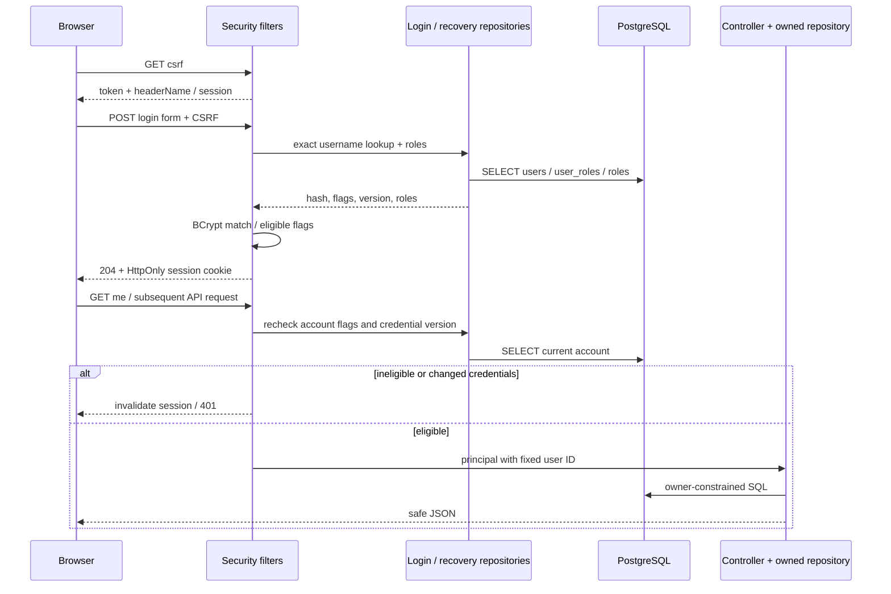
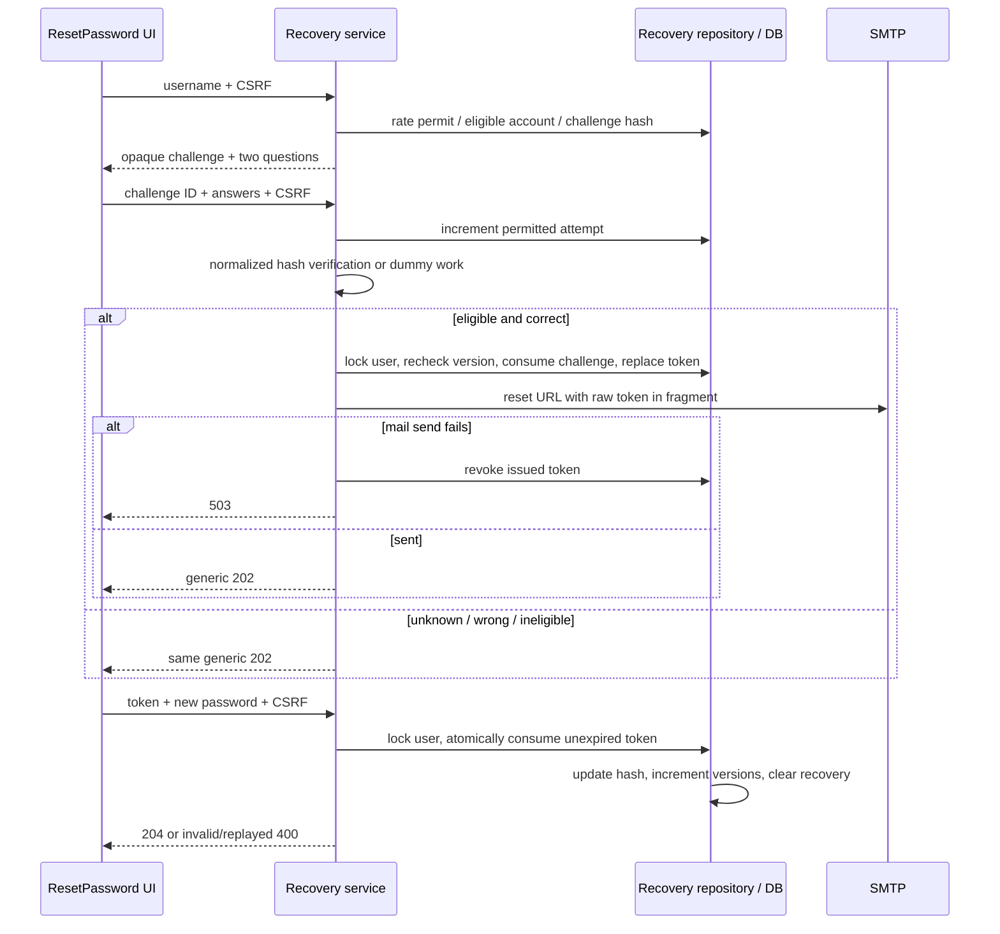
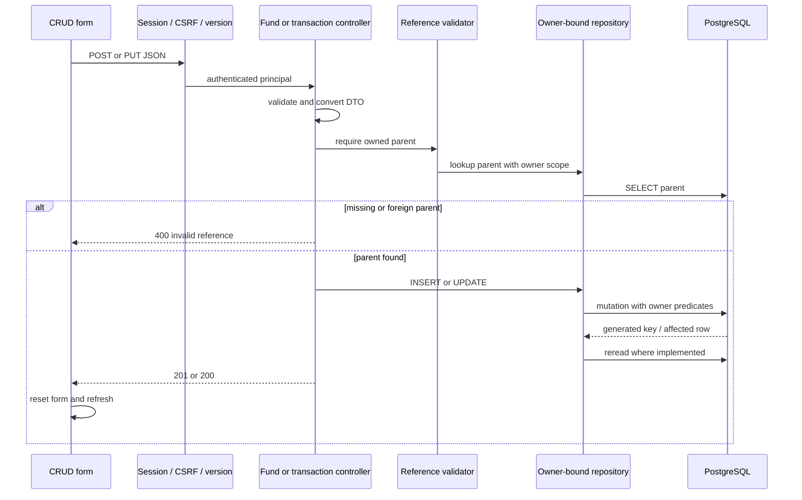

# Business workflows, calculations, batch and MCP

[Main report](../PROJECT_UNDERSTANDING.md). Commit `70b9f2c2e8621ed396019c6378c1a61b019cf701`; **C** unless marked otherwise. Payloads/data below are synthetic; implemented HTTP shapes are in [Contracts](CONTRACTS_AND_UI.md).

## Registration, session and authorization

Trigger Register.submit → client required/confirm/UTF-8 password checks → CSRF-protected POST/register → RegisterRequest validation → RegistrationService hashes BCrypt12 and transactionally inserts user, details and ROLE_USER → optional three recovery answers enrolled →201 safe registered user → UI success/login link. Duplicate username or case-insensitive email raises409 and rolls back all inserts; invalid optional answers also roll back. Submitted roles/status flags cannot elevate user. Registration does not log in or send verification email. Password length is12..72 characters and <=72 UTF-8 bytes, not merely a form character limit. [Register.jsx:5](../../trade-ui/src/components/Register.jsx#L5), [RegistrationService.java:23](../../trade-rest/src/main/java/com/trading/service/RegistrationService.java#L23), [UserRegistrationRepositoryImpl.java:1](../../trade-repository/src/main/java/com/trading/repository/impl/UserRegistrationRepositoryImpl.java#L1), [V8__user_profile_hint.sql:1](../../trade-repository/src/main/resources/db/migration/V8__user_profile_hint.sql#L1)



Logout POST with CSRF invalidates session/deletes JSESSIONID, UI clears views and broadcasts. Focus/60-second/BroadcastChannel refreshes propagate session changes between tabs. Invalid login always generic401; protected anonymous writes without valid CSRF also take the unauthenticated error path. Existing roles in principal are not refreshed per request, though flag/version checks are. No login rate limit/admin privilege path is implemented. [SecurityConfiguration.java:1](../../trade-rest/src/main/java/com/trading/security/SecurityConfiguration.java#L1), [CredentialVersionFilter.java:1](../../trade-rest/src/main/java/com/trading/security/CredentialVersionFilter.java#L1), [App.jsx:1](../../trade-ui/src/App.jsx#L1)

## Profile update and separate hint

Profile mount fetches current-user profile and static hint question list → edit safe fields → PUT/profile, with currentPassword when email or hint changes → strict JSON/Bean Validation → transaction locks users row → recheck account eligibility and expected credentialVersion → compare password when needed → validate email/phone/avatar/hint pair → normalize optional basic strings → update users/details and profile timestamp → if email changed increment recovery_version/delete pending challenges/tokens → safe reread →200 and reset local form. Wrong password403, duplicate email409, invalid input400; failed transaction does not partially save basics/hint. Username/owner/roles are immutable via this API. Omitted basic optional fields clear; omitted hints preserve. Hint hash uses raw answer (no recovery normalization) and is not a reset factor. [UserProfileService.java:29](../../trade-rest/src/main/java/com/trading/profile/UserProfileService.java#L29), [JdbcUserProfileRepository.java:32](../../trade-repository/src/main/java/com/trading/repository/impl/JdbcUserProfileRepository.java#L32), [Profile.jsx:50](../../trade-ui/src/components/Profile.jsx#L50)

## Recovery and username reminder

Enrollment exists only as authenticated API (or optional registration body): current password + three distinct question IDs1..3 → normalize each answer NFKC/strip/lowercase → SHA-256 text then BCrypt → row-lock and version check → replace answer hashes, increment recovery_version, invalidate pending recovery →204. Profile's single hint does not supply these answers. UI has neither enrollment screen nor recoveryAnswers fields in registration.

Reset trigger username → require usable mail config → source/account rate permits → purge expired state → lookup eligible account with exactly3 answers; otherwise construct dummy challenge → choose2 questions, random32-byte URL-safe unpadded challengeId (43chars), persist only SHA-256 hash with account key/recovery version and10-minute expiry →200 identically shaped challenge. Attempts are capped5 via conditional repository update; missing/expired/consumed challenges return generic acceptance early; a stored dummy challenge performs dummy hash checks. This is response-shape privacy, not a constant-time guarantee. Exact question set is validated; wrong answers do not send mail. [PasswordRecoveryService.java:67](../../trade-rest/src/main/java/com/trading/recovery/PasswordRecoveryService.java#L67), [JdbcPasswordRecoveryRepository.java:63](../../trade-repository/src/main/java/com/trading/repository/impl/JdbcPasswordRecoveryRepository.java#L63)



Reset token expiry15minutes, only one active token per user. Token issuance commits before email; reset delivery failure revokes it. Completion atomically consumes once; concurrent use cannot both succeed (**T**). Password change increments credential_version and recovery_version, so earlier sessions fail next version-filter check. No mail delivery retry/job exists. HTTP reset URL is permitted only for localhost; HTTPS host allowed; no query/fragment/userinfo in configured base URL. UI reads fragment then removes it from address bar and holds token in memory. [SmtpResetMailSender.java:1](../../trade-rest/src/main/java/com/trading/recovery/SmtpResetMailSender.java#L1), [JdbcPasswordRecoveryRepository.java:101](../../trade-repository/src/main/java/com/trading/repository/impl/JdbcPasswordRecoveryRepository.java#L101), [ResetPassword.jsx:1](../../trade-ui/src/components/ResetPassword.jsx#L1)

Rate buckets persist for15minutes: source30; challenge username5; verification account10; enrollment user5; reminder normalized email5. Limits are source/application actions, not IP identity proof; request.getRemoteAddr behind the local Node proxy can make clients share the proxy address.429 carries Retry-After900. Cleanup is triggered by challenge start, not scheduled maintenance. Username reminder uses case-insensitive stored-email lookup and stored recipient; enabled/unlocked/nonexpired-account flags checked (this reminder lookup does not require credentials_non_expired), no account-existence disclosure, send failure swallowed into generic202. Missing mail configuration yields503. [PasswordRecoveryService.java:38](../../trade-rest/src/main/java/com/trading/recovery/PasswordRecoveryService.java#L38), [PasswordRecoveryService.java:36](../../trade-rest/src/main/java/com/trading/recovery/PasswordRecoveryService.java#L36), [PasswordRecoveryController.java:53](../../trade-rest/src/main/java/com/trading/recovery/PasswordRecoveryController.java#L53)

## Broker, fund, transaction and valuation management

Create/update follows: UI form → synthetic payload in Contracts → CSRF/session/credential check → positive/reference/field validation where defined → owner-bound repository SQL → generated key/update → response → form reset/list/summary refresh. Brokers define account identity; funds associate scheme metadata with an owned broker; transactions record completed BUY/SELL facts; valuations record manually supplied total value as of a date. Changing status/metadata never creates a transaction, changes a valuation or alters which records count. No external broker API is called. [OwnedBrokerRepository.java:1](../../trade-repository/src/main/java/com/trading/repository/impl/OwnedBrokerRepository.java#L1), [OwnedFundRepository.java:1](../../trade-repository/src/main/java/com/trading/repository/impl/OwnedFundRepository.java#L1), [OwnedTxnRepository.java:1](../../trade-repository/src/main/java/com/trading/repository/impl/OwnedTxnRepository.java#L1), [OwnedValueRepository.java:1](../../trade-repository/src/main/java/com/trading/repository/impl/OwnedValueRepository.java#L1)



There is no encompassing CRUD transaction: the diagram's SELECT/mutation/reread are separate database operations. Invalid target404, invalid parent400, duplicate broker under V12/integrity400. Current live databases lack V12 so that duplicate rule is **not runtime-enforced there**. Duplicate transaction/value submissions create additional rows; no deduplication key. Form save has no general pending guard, no optimistic concurrency. Deletion uses DB FKs; linked orders prevent deleting or changing a transaction's fund until links are resolved. No partial cascade cleanup is implemented. List/update clients do not maintain caches beyond component state.

Order workflow is repository-only: an authorized factory caller supplies owner, fund, optional same-fund transaction link and nullable order facts → SQL owner/parent predicates plus same-fund FK link enforcement → INSERT/UPDATE → generated model. Unknown direction or unavailable amount/units/NAV may remain null/text/zero. The stored order is excluded from all portfolio calculations. The baseline had no automatic pending→completed transition, order REST API, UI or parser. The 8 October standalone Coin pipeline below adds parsing and explicit completion upserts; there is still no order REST API/UI. V11 moved descriptive metadata to transactions; unlinked orders can no longer store that metadata, so Coin retains source metadata in its V14 staging and reconciles it explicitly when posting transactions. [OwnedOrderRepository.java:1](../../trade-repository/src/main/java/com/trading/repository/impl/OwnedOrderRepository.java#L1), [coin-order-schema.md:1](../../coin-order-schema.md#L1)

## Zerodha upload: import and compatibility paths

**C/T, updated9 October:** select CSV → explicit Coin options form → multipart
file + application/json options + CSRF/session → REST uses session owner → bounded
CoinImportRuntime → all-record validation/DB preflight → immutable managed copy →
existing stage/project/finalize job →200 COMPLETED/persisted counts → UI refreshes
rows/totals. File-only API callers retain the original202 UPLOADED staging flow.
There is no asynchronous queue, polling endpoint or automatic processing of older
staged files. A timeout may leave a running/completed import, so use the same bytes
and options for retry. Admission is one web import per REST process; DB constraints
also cover other processes/CLI. See the [runbook](../COIN_BATCH_RUNBOOK.md#rest-and-ui-integration--9-october-2026).

[MutualFundTxnController.uploadZerodhaTransactions](../../trade-rest/src/main/java/com/trading/controller/MutualFundTxnController.java)
and [ZerodhaTransactionUploadService.importFile/stage](../../trade-rest/src/main/java/com/trading/upload/ZerodhaTransactionUploadService.java)
preserve route/owner/CSRF and old file-only responses. Validation/period conflicts
return safe errors; missing schema returns503. Some chunks can remain after a
runtime failure; resubmitting the same file resumes its job. V14 is not applied
automatically. No live service or application DB was changed during development.

## Financial computations and provenance

Only `mutual_fund_txn` completed rows and `mutual_fund_value` snapshots contribute. Orders never contribute, transaction status never filters inclusion, metadata cannot substitute for units or amount. Currency display assumes INR; schema has no currency column/conversion. No distributions, tax/fees, corporate actions, NAV fetching or benchmark histories are inferred.

| Calculation / layer | Exact rule and missing-data handling |
|---|---|
| Transaction Summary SQL | `COALESCE(SUM(amount),0)`, `COALESCE(SUM(units),0)` over owned selected/all transactions. BUY/SELL both added; totalUnits is not units held. [OwnedTxnRepository.java:90](../../trade-repository/src/main/java/com/trading/repository/impl/OwnedTxnRepository.java#L90) |
| All-fund investment SQL | BUY amount, SELL negative amount, other type0; LEFT JOIN includes zero-transaction funds. Negative historical SELL values differ from analytics ABS convention. [OwnedTxnRepository.java:20](../../trade-repository/src/main/java/com/trading/repository/impl/OwnedTxnRepository.java#L20) |
| Portfolio SQL + Java | CTE owner funds, cumulative txn aggregate through end date, latest snapshot in chosen range, then joins; BUY amount, SELL `-ABS(amount)`, invalid type triggers error. fromDate limits snapshots only, retaining opening transactions; toDate inclusive via next-day exclusive bound. Latest calendar DATE then highest valId, not intraday latest. [JdbcAnalyticsRepository.java:52](../../trade-repository/src/main/java/com/trading/repository/impl/JdbcAnalyticsRepository.java#L52) |
| Portfolio totals | Net investment sums; knownValueTotal sums available snapshots; totalValue/gain/return null unless all funds valued. Empty portfolio counts0 and zero sums, unavailable percentages/date where no comparison date. Broker grouping by ID excludes accounts with no funds. Gain=value−net. Percentage100×numerator/positive denominator, HALF_UP scale6. Allocation requires every value present/nonnegative and positive total. Contribution=BUY/totalBUY only if all fund BUY totals nonnegative and totalpositive. asOfDate explicit toDate else latest included txn/snapshot. |
| `investmentHistory` JS | Validate selected-fund transaction date/amount/direction; cumulative BUY amount−ABS(SELL amount). Includes before-from history, excludes after-to. Value dates/boundaries carry cumulative balance. Invalid selected-fund history throws; unrelated fund invalid records ignored. [investmentHistory.js:1](../../trade-ui/src/components/investmentHistory.js#L1) |
| `analyticsSummary` / `valueHistory` JS | Discard invalid/missing snapshot values/dates, sort calendar day/id; latest valid inside range. Cumulative investment and reliable units through end; BUY/SELL/count only in selected range; opening net before start. Gain/latest-minus-net and return only positive net. Later transaction warning signals dates differ. [analyticsMetrics.js:1](../../trade-ui/src/components/analyticsMetrics.js#L1) |
| Holdings / moving cost JS | For each calendar day pool buys before sells: U+=buy units,C+=buy amount; average=C/U; sale reduces U by units and C by soldUnits×average, not by proceeds. Positive finite units required for every record; historical oversell makes subsequent balances unknown. Tolerance1e−9 treats near-zero as exit; zero units with no cost gives average null. Later valid purchase after a valid full exit starts new pool; invalid-history balance does not recover automatically. Negative purchase cost makes average unavailable. [holdingsBalances.js:1](../../trade-ui/src/components/holdingsBalances.js#L1), [analyticsActivity.js:65](../../trade-ui/src/components/analyticsActivity.js#L65) |
| Cash flow buckets JS | Calendar month or quarter with zero-flow gaps inside known/requested extent; partial boundary buckets clipped. BUY positive, SELL shown negative ABS, net bought−sold. No known dates/bounds → empty, not invented timeline. [analyticsActivity.js:24](../../trade-ui/src/components/analyticsActivity.js#L24) |
| Activity table JS | Selected fund/date range, calendar day DESC/id DESC, pages loaded array20. Recorded averagePrice shown as given; not recomputed average cost. [analyticsActivity.js:16](../../trade-ui/src/components/analyticsActivity.js#L16), [AnalyticsDetails.jsx:81](../../trade-ui/src/components/AnalyticsDetails.jsx#L81) |
| XIRR JS | First/last valid in-range snapshot delimit covered period; opening snapshot negative, subsequent net contributions negative, final snapshot positive. Exclude opening-day and after-final flows. Net same-day using compensated sum and floating tolerance. Solve `Σ c_i/(1+r)^((day_i−day_0)/365)=0` by160-step bisection in log(1+r), supported rate−0.9999999999..1,000,000. Requires one negative→positive sign change, separate dates, positive opening/nonnegative closing; ambiguous/no roots unsupported. Display annualized percent. [advancedReturnMetrics.js:37](../../trade-ui/src/components/advancedReturnMetrics.js#L37) |
| TWR JS | Require snapshot on every nonzero net-flow day after opening through closing. Factor=(closing−net contribution on closing day)/opening; product factors−1, not annualized. Positive interval openings/nonnegative values/adjusted close; missing flow-date value disables complete chain. Full sale can end an interval at0 but0 cannot open next one. [advancedReturnMetrics.js:1](../../trade-ui/src/components/advancedReturnMetrics.js#L1) |
| Drawdown JS | Performance index starts100 and multiplies TWR factors; drawdown=100×(index/runningPeak−1). Maximum most negative, current final. Missing complete chain→null. Observations only at snapshots; no inferred intervening highs/lows. Peak recorded value separately includes cash contributions and earliest date wins tie. |
| Monthly returns/volatility JS | Exact previous calendar month-end/current month-end plus intervening flow-date snapshots; no business-day substitution. Partial months visible but excluded. Sample SD of monthly percentage returns using n−1, >=2 complete consecutive months with no gaps; annualized SD×sqrt12. Missing any complete month invalidates volatility; later supported individual month can still display. |

Numeric examples exercised by tests (**T**): buy10 units for100 then10 for200 →20units/average15; sell5 →15units/average15. Opening100 → snapshot160 afterBUY50 → snapshot136 afterSELL40 produces factors1.1 and1.1, TWR21%, no drawdown. No-flow values100,120,90,108 →max drawdown−25%, current−10%, TWR8%. −100 then+110365days later →XIRR10%; two complete monthly returns+10%/−10% →SD√200=14.14%, annualized√2400=48.99%. [AnalyticsDetails.test.jsx:1](../../trade-ui/src/components/AnalyticsDetails.test.jsx#L1), [AdvancedReturns.test.jsx:1](../../trade-ui/src/components/AdvancedReturns.test.jsx#L1), [PortfolioAnalyticsTest.java:1](../../trade-rest/src/test/java/com/trading/analytics/PortfolioAnalyticsTest.java#L1), [PostgresPortfolioAnalyticsTest.java:1](../../trade-rest/src/test/java/com/trading/analytics/PostgresPortfolioAnalyticsTest.java#L1)

These implemented estimates are not tax cost basis or a claim of financial standards compliance. Different snapshot dates across funds can make portfolio comparison temporally uneven; UI exposes dates/later-transaction warnings. Complete history paging lacks database snapshot consistency under concurrent changes; no stored derived holdings/returns table exists. See dictionary for decimal/date limits and value-management overview differences.

## Batch processing

### Jobs, discovery and lifecycle

Both @SpringBootApplication classes live in `com.trading` and implement CommandLineRunner; shared component scanning discovers both configs/services/app classes (**I:** both runners may execute at either startup; no context test). Packaged Start-Class is TradeBatchApplication, not separate ledger artifact. `spring.batch.job.enabled=false` disables Boot auto-launch only; custom runners call services anyway. They do not wait for all async completion or convert later job failure into command exit status. [TradeBatchApplication.java:1](../../trade-batch/src/main/java/com/trading/TradeBatchApplication.java#L1), [LedgerBalancesBatchApplication.java:1](../../trade-batch/src/main/java/com/trading/LedgerBalancesBatchApplication.java#L1), [pom.xml:39](../../trade-batch/pom.xml#L39)

Each service verifies configured path is a directory → Files.list or Files.walk(recursive) → regular filenames ending exactly `.csv` → no defined order → one job per file with identifying parameters `truncateFlag`, absolute `inputFile`, current millisecond `timestamp`. New timestamp generally means new instance on re-import, not automatic resume/deduplication; original framework restart metadata could be reused externally but this code exposes no restart operation. No file claim/lock/rename; a producer can modify a file during reading (**I**). Directory streams are not explicitly closed in try-with-resources. [BatchJobService.java:40](../../trade-batch/src/main/java/com/trading/service/BatchJobService.java#L40), [LedgerBalancesBatchJobService.java:42](../../trade-batch/src/main/java/com/trading/service/LedgerBalancesBatchJobService.java#L42)

```mermaid
sequenceDiagram
  participant Runner
  participant S as File discovery
  participant E as Async job executor
  participant DB as Shared PostgreSQL
  participant Reader as Reader / mapper / processor
  Runner->>S: list configured directory
  loop each CSV, unspecified order
    S->>E: start job with file/timestamp/truncateFlag
    E-->>S: launch returns before job completion
    opt truncateFlag true
      E->>DB: table-wide DELETE in separate step transaction
    end
    loop chunks
      E->>Reader: read/convert/process items
      Reader-->>E: mapped entities or parse errors
      E->>DB: JPA saveAll in chunk transaction
      Note over E,DB: skips within limit; earlier chunks remain committed
    end
  end
```

Trade executor core5/max10, ledger8/max10, both queue25 and CallerRunsPolicy, same MyApp thread prefix. Parallelism is separate file jobs; no chunk-level task executor. Job/reader beans explicitly scoped/qualified where needed, other executor/operator selection relies on method/field names. One generic JobExecutionListener bean named ledgerJobExecutionListener serves both. New MapJobRegistry has no explicit custom job-registration flow; launch passes Job directly. [BatchConfiguration.java:77](../../trade-batch/src/main/java/com/trading/batch/config/BatchConfiguration.java#L77), [LedgerBalancesBatchConfiguration.java:74](../../trade-batch/src/main/java/com/trading/batch/config/LedgerBalancesBatchConfiguration.java#L74)

### Exact input schemas

| Pipeline | CSV positional order and conversion | Transform/write |
|---|---|---|
| Trade | symbol,isin,trade_date,exchange,segment,series,trade_type,auction,quantity,price,trade_id,order_id,order_execution_time. Text trim-to-null; trade_date yyyy-MM-dd; execution yyyy-MM-dd'T'HH:mm:ss; auction blankfalse else readBoolean; quantity int; price BigDecimal; trade_id long. | Mapper constructs TradeRecord (createdAt now); processor passthrough/debug; JPA UUID and saveAll→trade_records. No stored input filename or source row number. |
| Ledger | particulars,posting_date,cost_center,voucher_type,debit,credit,net_balance. Date yyyy-MM-dd; strings trim-to-null; debit/credit/net BigDecimal. | Processor adds absolute filename and LocalDateTime.now; JPA UUID/saveAll→ledger_records. Never ledger_balances. |

Synthetic headerless trade row: `EXAMPLE,INF000000001,2026-10-01,NSE,EQ,EQ,buy,false,2,10.25,9001,00009001,2026-10-01T10:30:00`.

Synthetic ledger row: `Example purchase,2026-10-01,EQ,JV,20.50,0.00,100.00`.

Tokenizer is comma-delimited positional framework parser; no linesToSkip/header policy/custom dialect. Header becomes data and typically fails date/number parsing, consuming skip allowance. CSV quotes follow framework tokenizer behavior, not a bespoke source normalization contract. Uppercase BUY differs from trade entity's lowercase check; `N/A` numeric/date values fail; fractional quantity fails Java Integer even though SQL numeric allows it. Mapper parses blank net balance despite nullable SQL. Ledger voucher type is Java required though SQL nullable. [TradeFileItemReader.java:1](../../trade-batch/src/main/java/com/trading/batch/reader/TradeFileItemReader.java#L1), [TradeFieldSetMapper.java:1](../../trade-batch/src/main/java/com/trading/batch/reader/mapper/TradeFieldSetMapper.java#L1), [LedgerFileItemReader.java:1](../../trade-batch/src/main/java/com/trading/batch/reader/LedgerFileItemReader.java#L1), [LedgerRecordFieldSetMapper.java:1](../../trade-batch/src/main/java/com/trading/batch/reader/mapper/LedgerRecordFieldSetMapper.java#L1), [TradeRecord.java:1](../../trade-model/src/main/java/com/trading/model/TradeRecord.java#L1), [LedgerRecord.java:1](../../trade-model/src/main/java/com/trading/model/LedgerRecord.java#L1)

### Transactions, failures and operational configuration

Jobs always run delete step then chunk step. Methods named truncate use JPQL DELETE WHERE1=1, not TRUNCATE; execution only if flagtrue. Deletion commits separately. Trade chunk1000/skip100; ledger chunk1000/skip3 (configuration value overrides code fallback). Broad Exception.class skipping includes mapping/validation/persistence failures; no explicit retry/backoff. Chunk rollback/recovery is framework-managed; unskippable/exceeded-limit failure terminates job with prior commits intact. Two concurrent files with truncate can erase each other's writes. UUID generation plus absent source uniqueness means re-import can duplicate records; existsByTradeId is never invoked. **No destructive scenario was executed.** [BatchConfiguration.java:59](../../trade-batch/src/main/java/com/trading/batch/config/BatchConfiguration.java#L59), [LedgerBalancesBatchConfiguration.java:56](../../trade-batch/src/main/java/com/trading/batch/config/LedgerBalancesBatchConfiguration.java#L56), [TradeRecordRepository.java:40](../../trade-repository/src/main/java/com/trading/repository/impl/TradeRecordRepository.java#L40), [LedgerRecordRepository.java:32](../../trade-repository/src/main/java/com/trading/repository/impl/LedgerRecordRepository.java#L32)

Readers log read count as successful records, which is not committed writer count. Listener logs final status, timing, per-step read/write/skip totals and failures; the “COMPLETED” banner can appear for failure and must not replace status checking. Writer exceptions rethrow. Runner catches discovery/submission exceptions only. No archive/rejected-row output exists despite configuration names; no durable file import result summary beyond framework metadata/logging. Hibernate and Batch/SQL schema initialization disabled; exact transaction-manager/job-repository wiring remains runtime-unverified.

| Config key | Default/meaning |
|---|---|
| batch.csv.input-file-path / batch.csv.ledger-input-file-path | Developer-local trade/ledger directories; both overridden by same CSV_INPUT_FILE variable |
| batch.truncate-flag / batch.ledger-truncate-flag | FALSE; table-wide delete per launched job when true |
| batch.recursive-flag / batch.ledger-recursive-flag | FALSE; choose list vs recursive walk |
| batch.chunk-size / batch.ledger-chunk-size |1000 |
| batch.skip-limit / batch.ledger-skip-limit |100 /3 |
| Error/archive path properties | Declared, unused; archive overrides also mistakenly use CSV_ERROR_FILE |
| datasource/profile | postgresd or postgresp/public; shared schema, no per-owner context |

At the 6 October baseline no batch module tests existed. The Coin suites added on
8 October exercise the isolated Coin job and exclude it from legacy scans; they do
not establish safe destructive behavior for the legacy pipelines above. Operational
investigation of those runners still needs an isolated database/input directory and
explicit append/replace/dedupe/reject/archive semantics.

**C, 7 October 2026 Coin specification refresh:** offline dependency resolution
confirmed Spring Batch 6.0.3 and Spring JDBC/Tx 7.0.7. The locally resolved
`EnableBatchProcessing` source defaults to ResourcelessJobRepository; no explicit
JDBC JobRepository configuration exists in current batch source. Thus the earlier
flow diagram's Batch metadata persistence arrow is intended infrastructure, not
runtime proof. V2 tables alone do not establish durable checkpoints. The
[Coin requirements](../COIN_ORDER_HISTORY_BATCH_REQUIREMENTS.md) propose explicit
EnableJdbcJobRepository/JdbcTransactionManager in an isolated Coin launcher,
immutable file identity, staged validation and atomic order projection. No
application runner/context or restart was exercised; legacy pipelines were not
changed. Actual source tags contain unquoted JSON text with literal quotes, so a
lossless Coin reader needs dialect tests rather than reuse of trimToNull mappers.

**C/I, 8 October 2026 handoff review:** the proposed Coin launcher must be
isolated in both directions. Both legacy application classes use the default
`com.trading` component scan, so new annotated Coin components below that root
could enter legacy contexts even when the Coin launcher itself uses a narrow
scan. The [Coin startup proposal](../COIN_ORDER_HISTORY_BATCH_REQUIREMENTS.md#6-proposed-spring-batch-contract)
now requires a registration/exclusion boundary and tests of both entry points;
selecting a different packaged main is not sufficient. This is a source-based
design finding; no launcher or context test was executed and no code changed.

**User requirement/P, 8 October:** the proposed Coin flow now runs a
[user/fund period gate](../COIN_ORDER_HISTORY_BATCH_REQUIREMENTS.md#user-and-mutual-fund-period-tracking)
before source-row staging. Recommended defaults are declared export bounds and
rejection of any overlap. Resolve all represented funds/dates, then claim the file
and every fund period in one transaction; one conflict rejects the whole file.
Failed or partly committed imports retain their reservation; only the same
import resumes it. Finalization records accepted coverage without implying
transaction posting. Same-period corrections require a separate audited process.
This supersedes the earlier proposal to stage every changed/overlapping export
and defer unresolved fund/date coverage after DB ingestion. These are design
requirements and proposed defaults, not implemented runtime behavior.

## Coin import workflow — implemented 8 October 2026

**C/T:** this supersedes the proposed Coin flow immediately above after the user
requested implementation and PROCESSING-to-COMPLETE upserts. See the
[runbook](../COIN_BATCH_RUNBOOK.md) for the complete launch/recovery contract.

Explicit arguments → validate all files/records → read-only DB preflight for all
files → for each accepted file: managed immutable copy → transactional owned
account/fund locks and atomic file/period reservation → JDBC Batch stage chunks →
project/upsert chunks → finalize file/period states → report durable counts.
VALIDATE ends before opening Spring/DB; DRY_RUN ends without any managed copies or
DB writes. File processing is sequential, not atomic across the entire input list.

Identifying Batch parameters are owner, account, source system and content hash.
Parser/policy/period/mappings are frozen in the file contract. Exact replay returns
the previous result. A FAILED job resumes its committed checkpoint in another JVM;
failed coverage stays blocked. Changed input/policy cannot create a second load
through restart. STARTED/UNKNOWN after an ungraceful kill needs reviewed recovery.

New coverage excludes inclusive owner/fund date overlaps. A completion snapshot
can reuse an exact LOADED reservation only for existing unchanged/completing
orders, with at least one completion in the file. The same order ID is updated,
raw snapshots remain immutable, and a chosen posting policy inserts/links one
transaction atomically. Other funds' unchanged rows may accompany the update.
New orders in covered periods, backward/conflicting changes and unresolved manual
matches are rejected. ORDER_ONLY does not change portfolio transactions/totals.

Evidence: [CoinImportService.execute](../../trade-batch/src/main/java/com/trading/coin/CoinImportService.java),
[JdbcCoinImportRepository.prepare/project](../../trade-repository/src/main/java/com/trading/repository/impl/JdbcCoinImportRepository.java),
[CoinBatchConfiguration](../../trade-batch/src/main/java/com/trading/coin/CoinBatchConfiguration.java),
[CoinImportIntegrationTest](../../trade-batch/src/test/java/com/trading/coin/CoinImportIntegrationTest.java).
The 9 October upload integration now invokes this pipeline when options are
supplied; no application DB import or service restart was performed.

## MCP contracts and independent runtime

MCP runs a separate WebFlux/ASYNC process on127.0.0.1:8081, SSE `/sse`, messages `/mcp/message`. ToolCallbackProvider discovers @Tool methods; @McpResource defines the resource. Inputs below are the Java argument-level contract; actual generated JSON Schema and MCP result envelope/discovery were **not live captured**. No Spring Security filter chain/client identity/user ownership in this module. Global credentialed wildcard-pattern CORS permits browser-origin requests to reachable server; loopback binding is its configured network boundary. Explicit Hikari max10/min5 and connection/idle30s do not bound individual SQL query runtime. Calls block in JPA/JDBC; resource does query before Mono.just. No retry/timeout/exception adapter is coded. [application.properties:1](../../trade-mcp-server/src/main/resources/application.properties#L1), [McpConfig.java:1](../../trade-mcp-server/src/main/java/com/trading/mcp/conf/McpConfig.java#L1), [CorsConfig.java:1](../../trade-mcp-server/src/main/java/com/trading/mcp/conf/CorsConfig.java#L1)

| Entry point | Inputs/schema at Java boundary | Calls/SQL and returned data | Important semantics |
|---|---|---|---|
| `Get-Ledger-Details-By-Date-Range` / getLedgerDetailsByDateRange | date1,date2:LocalDate; expected JSON ISO date strings | LedgerRecordRepository.findBetweenPostingDates, inclusive BETWEEN posting_date; List<LedgerRecord> with UUID, particulars,date,costCenter,voucherType,debit,credit,netBalance,fileName,createDateTime | No pagination/sort/owner/reversed-range validation. Description asks client to interpret particulars; server does no grouping/description parsing. |
| `Average-Buy-Price-and-Count` / getAvgBuy | symbol:String @ToolParam/@NotNull | TradeRecordRepository.findAverageByTradeType(symbol,"buy") → JPQL SUM(price×quantity),SUM(quantity),symbol,tradeType → TradeDetailsResult | avgPrice unset; totalPrice is not an average; total bought quantity is not current position after sales. Unknown symbol may yield no grouped result; envelope behavior unverified. |
| `Average-Sell-Price-and-Count` / getAvgSell | symbol:String | Same JPQL with "sell" | Total sell value/quantity; no explicitly calculated avgPrice. |
| `Average-Buy-Sell-Price-and-Count` / getOverallBuyAvgSellAvg | symbol:String | FastLane NamedParameter JDBC query → List<TradeDetailsResult> | LAG previous type by execution timestamp/symbol, running transition group, MIN/MAX time, SUM quantity, ROUND(AVG(price),2); **unweighted** price. Mapper discards trade count, totalPrice unset; tie timestamps lack deterministic ID order. |
| `All-Valid-Symbols`, URI `symbols` / getAllValidSymbols | Resource read URI symbols, no custom params | JPA distinct symbols → Mono<List<String>> | Global unsorted symbols from trades, not a validated security master or fund list. |

Evidence: [TradeMcpServerTools.java:1](../../trade-mcp-server/src/main/java/com/trading/mcp/tools/TradeMcpServerTools.java#L1), [TradeMcpServerResources.java:1](../../trade-mcp-server/src/main/java/com/trading/mcp/resources/TradeMcpServerResources.java#L1), [TradeRecordRepository.java:35](../../trade-repository/src/main/java/com/trading/repository/impl/TradeRecordRepository.java#L35), [LedgerRecordRepository.java:22](../../trade-repository/src/main/java/com/trading/repository/impl/LedgerRecordRepository.java#L22), [TradeRecordFastLaneRepository.java:10](../../trade-repository/src/main/java/com/trading/repository/TradeRecordFastLaneRepository.java#L10), [TradeRecordFastLaneRepositoryImpl.java:1](../../trade-repository/src/main/java/com/trading/repository/impl/TradeRecordFastLaneRepositoryImpl.java#L1), [TradeDetailsResult.java:1](../../trade-model/src/main/java/com/trading/model/result/TradeDetailsResult.java#L1).

Representative expected protocol request shapes (illustrative envelopes; transport handshake not verified):

```json
{"jsonrpc":"2.0","id":1,"method":"tools/call","params":{"name":"Average-Buy-Price-and-Count","arguments":{"symbol":"EXAMPLE"}}}
```

```json
{"jsonrpc":"2.0","id":2,"method":"tools/call","params":{"name":"Get-Ledger-Details-By-Date-Range","arguments":{"date1":"2026-10-01","date2":"2026-10-07"}}}
```

```json
{"jsonrpc":"2.0","id":3,"method":"resources/read","params":{"uri":"symbols"}}
```

For synthetic buys2@10 and8@20, JPA sums produce totalPrice180,quantity10; weighted average would18 but is not populated. One contiguous fast-lane buy group computes avgPrice15,quantity10. That difference is implemented SQL semantics, not rounding error. **R:** the copied query, including `COUNT(grouped_trades.*)`, executed successfully on PostgreSQL18.4 against synthetic VALUES in a read-only session. It returned the expected counts/quantities/unweighted averages; the older syntax concern is resolved for this probe. No application test currently covers its Java mapper or MCP transport. Nullable externally inserted execution timestamps can also break row mapper's unguarded timestamp conversion (**I**).

MCP shares raw trade/ledger data with batch, not REST portfolio ownership or DTO/date formats. Its packaged manifest references nonexistent `com.trading.mcp.server.TradeMcpServerApplication` while the included class is `com.trading.TradeMcpServerApplication` (**R**, artifact inspection). Property `veersion` is misspelled; resource capability/discovery remains unverified. spring-ai-ollama dependency is declared but no model call/prompt/RAG workflow consumes it or AI tables. No MCP/browser client is included. A package build therefore proves neither tool discovery nor useful MCP runtime.
