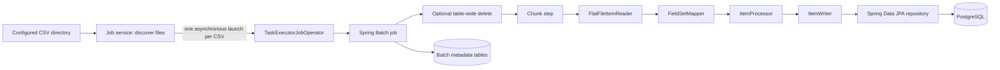

# `trade-batch` architecture

## Purpose and boundary

`trade-batch` is a Spring Batch command-line module with two independent CSV imports: the trade-book pipeline writes `trade_records` through `TradeRecordRepository`, and the ledger pipeline writes `ledger_records` through `LedgerRecordRepository`.

It depends on `trade-repository` and `spring-boot-starter-batch`. It has no HTTP or MCP interface and does not own database migrations. Trade and ledger persistence use Spring Data JPA; the JDBC mutual-fund persistence path is outside this module.

The module deliberately disables Flyway, Spring Batch schema initialization, and SQL initialization. A migrated shared PostgreSQL database is therefore required before it can run: V2 provides Spring Batch metadata tables and V3 provides the business tables. This document is a source-based analysis as of 2026-09-22, not proof of a particular deployment's database or input-file readiness.

## Module layout

```text
trade-batch/
├── pom.xml
├── src/main/resources/application.properties
└── src/main/java/com/trading/
    ├── *BatchApplication.java       Boot entry points and runners
    ├── service/                     file discovery and job submission
    └── batch/
        ├── config/                  jobs, steps, tasklets and executors
        ├── reader/ and mapper/      file readers and CSV mapping
        ├── processor/               per-record handling
        ├── writer/                  chunk persistence
        └── listener/                job lifecycle logging
```

No files exist under `trade-batch/src/test`; this module currently has no module-local automated behavior tests.

## Runtime flow



Both jobs use the application `JobRepository` and `PlatformTransactionManager`. Their delete tasklet and chunk step explicitly use that manager. Writers call JPA `saveAll`, so normal chunk writes participate in the Spring Batch step transaction.

## Entrypoints and executable behavior

| Class | `CommandLineRunner` action | Packaging status |
|---|---|---|
| `TradeBatchApplication` | Runs `BatchJobService.runCsvProcessingJob()` | The Boot jar's `Start-Class` |
| `LedgerBalancesBatchApplication` | Runs `LedgerBalancesBatchJobService.runCsvProcessingJob()` | Included in the jar, but not its manifest launcher |

The Maven Spring Boot plugin selects `TradeBatchApplication`; `java -jar trade-batch-...jar` therefore launches that class. The ledger class needs an explicit alternate main-class/launcher arrangement, since the module provides no separate ledger artifact.

Both application classes use `@SpringBootApplication` and reside in `com.trading`. Default component scanning therefore discovers both applications, both configurations, and both services. Because both application classes implement `CommandLineRunner`, either process startup should be treated as potentially invoking both runners until a context/runtime test proves otherwise. The two pipelines share the database and may then submit work concurrently.

`spring.batch.job.enabled=false` prevents Boot's automatic job launcher. Custom runners submit jobs after startup. A runner exits with status 1 if listing or submission throws, but it cannot catch a failure that occurs later in an asynchronously submitted job.

## Trade-book pipeline

`BatchConfiguration` creates the following job:

```text
csvProcessingJob
├── deleteRecordsStep
│   └── truncateTradeTableTasklet
│       └── TradeRecordRepository.truncateTradesTable() when truncateFlag=true
└── csvProcessingStep
    └── read TradeRecord → process TradeRecord → write TradeRecord chunks
```

The trade executor has 5 core threads, 10 maximum threads, a 25-item queue, `MyApp-` names, and `CallerRunsPolicy`. The chunk size defaults to 1000 and the skip limit to 100. The step skips `IllegalArgumentException` and the broader `Exception`; the latter subsumes the former. There is no retry configuration.

`TradeFileItemReader` is step scoped. It requires the `inputFile` job parameter, verifies its path exists, and installs it as a `FileSystemResource`. `TradeFieldSetMapper` reads a comma-delimited record with this fixed order:

| CSV fields | Mapping |
|---|---|
| `symbol`, `isin`, `exchange`, `segment`, `series`, `trade_type`, `order_id` | Trimmed string; blank becomes `null` |
| `trade_date` | `LocalDate` in `yyyy-MM-dd` |
| `auction` | Blank becomes `false`; otherwise `FieldSet.readBoolean` |
| `quantity` | Integer |
| `price` | `BigDecimal` |
| `trade_id` | Long |
| `order_execution_time` | `LocalDateTime` in `yyyy-MM-dd'T'HH:mm:ss` |

The reader has no header-skip setting. A normal header is parsed as a data row and normally consumes a skip due to date/numeric conversion. It has no custom CSV dialect, header validation, or explicit quoted-field policy.

`TradeRecordItemProcessor` only debug-logs and returns the same object. It does not validate, normalize, deduplicate, or preserve source-file identity. The mapper creates a `TradeRecord`, whose constructor assigns `createdAt`. `TradeRecordItemWriter` calls `TradeRecordRepository.saveAll` for each chunk.

The trade model/database contract requires core trade values, and the database check permits only lowercase `buy` or `sell`. The mapper does not normalize values, so the incoming file must already satisfy the persistence contract.

## Ledger-record pipeline

The names `LedgerBalancesBatchApplication`, `LedgerBalancesBatchConfiguration`, and `LedgerBalancesBatchJobService` do not describe the implemented destination: this pipeline writes `ledger_records`; it neither computes nor persists `ledger_balances`.

`LedgerBalancesBatchConfiguration` creates:

```text
ledgerCsvProcessingJob
├── deleteLedgerRecordsStep
│   └── truncateLedgerTableTasklet
│       └── LedgerRecordRepository.truncateLedgerRecordTable() when truncateFlag=true
└── ledgerCsvProcessingStep
    └── read LedgerRecord → enrich LedgerRecord → write LedgerRecord chunks
```

The ledger executor has 8 core threads, 10 maximum threads, a 25-item queue, the `MyApp-` prefix, and `CallerRunsPolicy`. The configured chunk size is 1000. The configuration has a skip-limit fallback of 100, but `application.properties` sets `batch.ledger-skip-limit=3`; the effective normal skip budget is three items. It has the same broad `Exception` skip policy and no retries.

`LedgerFileItemReader` has the same step-scoped input-file/path validation and resource setup. `LedgerRecordFieldSetMapper` expects the following fixed comma-delimited order:

| CSV fields | Mapping |
|---|---|
| `particulars`, `cost_center`, `voucher_type` | Trimmed string; blank becomes `null` |
| `posting_date` | `LocalDate` in `yyyy-MM-dd` |
| `debit`, `credit`, `net_balance` | `BigDecimal` |

There is no header skip. The step-scoped `LedgerRecordItemProcessor` gets `inputFile` from job parameters, sets it as `fileName`, and sets `createDateTime = LocalDateTime.now()` for each row. `LedgerRecordItemWriter` calls `LedgerRecordRepository.saveAll` for each chunk.

The ledger mapping requires posting date, cost center, debit, credit, file name, and creation time. The schema allows `voucher_type` to be null while the Java model marks it `@NotBlank`; the mapper does not independently validate or reconcile that mismatch.

## Discovery, job parameters, and concurrency

`BatchJobService` and `LedgerBalancesBatchJobService` share the same pattern:

1. Treat their configured input path as a directory; a non-directory stops the service before jobs are submitted.
2. Select regular files ending in lowercase `.csv`; recursive traversal is controlled by the pipeline's flag.
3. Submit one asynchronous job per file with `truncateFlag`, an absolute `inputFile`, and a millisecond `timestamp`.

The timestamp intentionally makes every submission a new Spring Batch job instance, including a repeat import of the same file. There is no defined file order, locking, claim/rename, archive, resume, duplicate test, or idempotency key. `Files.list` and `Files.walk` are not enclosed in try-with-resources, so directory traversal streams are not explicitly closed by this code.

The truncate option is unsafe with multiple files: every concurrently submitted job can delete the whole destination table before its own chunks write. One job can therefore erase another job's earlier imported rows. Use truncation only for a controlled single-file replacement run until execution is sequenced.

## Configuration

All settings are in [application.properties](src/main/resources/application.properties).

| Settings | Default | Purpose |
|---|---|---|
| `batch.csv.input-file-path` | `CSV_INPUT_FILE` or `.../files-trade/` | Trade input directory |
| `batch.truncate-flag`, `batch.recursive-flag` | `FALSE`, `FALSE` | Trade deletion and discovery |
| `batch.chunk-size`, `batch.skip-limit` | `1000`, `100` | Trade chunk/skip policy |
| `batch.csv.ledger-input-file-path` | Same `CSV_INPUT_FILE` or `.../files-ledger/` | Ledger input directory |
| `batch.ledger-truncate-flag`, `batch.ledger-recursive-flag` | `FALSE`, `FALSE` | Ledger deletion and discovery |
| `batch.ledger-chunk-size`, `batch.ledger-skip-limit` | `1000`, `3` | Ledger chunk/skip policy |
| `spring.datasource.*` | PostgreSQL localhost defaults plus `DB_USERNAME`/`DB_PASSWORD` | JPA and Batch metadata access |

Both input paths use the same `CSV_INPUT_FILE` environment variable, so one override redirects both pipelines to one directory. Trade/ledger error-file and archive-file properties are declared but never injected or used: the code writes no rejected-row report and archives no input file. The archive properties also use `CSV_ERROR_FILE`, not a separate archive environment variable.

## Wiring and observability

Each configuration supplies an executor, `TaskExecutorJobOperator`, reader, delete tasklet, two steps, and a job. Qualifiers select job beans and the ledger operator. The trade operator field and executor method parameters rely on bean/parameter names where multiple beans share a type; a context-startup test should protect this resolution through framework upgrades.

`JobExecutionListener` logs job name and parameters, timing, duration, per-step read/write/skip counts, and failure messages. It is declared as `ledgerJobExecutionListener` and injected by type into the trade configuration, so both jobs use one generic listener implementation. Readers log selected files and counts; writers log chunks and persistence errors. JDBC debug logging is enabled, which can be noisy for large imports.

## Key findings and operating guidance

| Finding | Consequence |
|---|---|
| Broad `Exception` skipping | Bad mapping, validation, and persistence rows can be skipped up to the limit without a reject artifact |
| No header policy | Header rows normally consume skip budget |
| No source identity/deduplication | Re-running an input can create duplicate records |
| Concurrent per-file jobs plus truncate | Imports can race and delete each other's rows |
| No archive/error-file implementation | Completion and rejected rows have no file lifecycle evidence |
| Ledger naming mismatch | The module does not create ledger balances |
| No batch tests | Context, mapper, skip, and concurrency behavior lack module-level verification |
| Initialization disabled | The process relies on externally applied business and Batch schemas |

Apply migrations before running. Use separate trade and ledger directory configuration, keep truncate flags false for routine imports, and supply headerless files in the documented order and formats. Treat job logs plus persisted row counts as the only completion evidence. Before production use, add context, mapper, reader, job, skip/retry, and multi-file/truncation tests; then define durable rejected-record, archive, idempotency, and single-writer replacement behavior.

## Source map

| Concern | Primary files |
|---|---|
| Entrypoints | `TradeBatchApplication.java`, `LedgerBalancesBatchApplication.java` |
| Jobs and steps | `batch/config/BatchConfiguration.java`, `LedgerBalancesBatchConfiguration.java` |
| File discovery and launch | `service/BatchJobService.java`, `LedgerBalancesBatchJobService.java` |
| Readers and mappers | `batch/reader/*`, `batch/reader/mapper/*` |
| Processors and writers | `batch/processor/*`, `batch/writer/*` |
| Job reporting | `batch/listener/JobExecutionListener.java` |
| Models and repositories | `trade-model` `TradeRecord`/`LedgerRecord`; `trade-repository` `TradeRecordRepository`/`LedgerRecordRepository` |
| Schema ownership | `trade-repository/src/main/resources/db/migration/V2__spring_batch_schema.sql`, `V3__application_schema.sql` |
